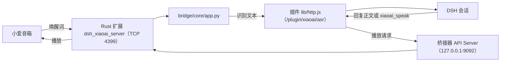

<div align="center">
  <h1>DSH XiaoAI Bridge</h1>
  <p>把小爱音箱接进 DeepSeek Harness：喊一声唤醒词，答案从音箱里念出来。</p>
  <p>桥接器是本地 Python 服务（源码在 <code>bridge/</code>），由插件当子进程托管；设置页、状态卡、播报纪律都在插件这一半。</p>

  <p>
    <a href="CHANGELOG.md"></a>
    <a href="https://github.com/deepseek-ai/dsh"></a>
    <a href="LICENSE"></a>
    <a href="https://github.com/OMSociety/dsh-xiaoai-bridge/stargazers"></a>
    <a href="https://github.com/OMSociety/dsh-xiaoai-bridge/issues"></a>
  </p>

  <p>
    <a href="#这是什么">这是什么</a> •
    <a href="#核心特性">核心特性</a> •
    <a href="#功能概览">功能概览</a> •
    <a href="#工作原理">工作原理</a> •
    <a href="#快速开始">快速开始</a> •
    <a href="#模型工具">模型工具</a> •
    <a href="#配置项说明">配置项说明</a> •
    <a href="#数据放在哪">数据放在哪</a> •
    <a href="#排错">排错</a> •
    <a href="#开发">开发</a> •
    <a href="#许可证与作者">许可证与作者</a>
  </p>
</div>

> **免责声明：**本项目是非官方技术研究项目，与小米及其关联公司没有隶属、合作、授权或背书关系；按「现状」提供，不附带任何保证。刷机与客户端补丁存在设备损坏、数据丢失、账号封禁等未知风险，动手前请读 [DISCLAIMER.md](DISCLAIMER.md)。

## 这是什么

小爱音箱刷成 open-xiaoai 客户端之后，就能在设备上跑自己的语音程序。这个仓库把它接进 DeepSeek Harness：

- 你说唤醒词，音箱开始收音；识别出来的文本被当成一句用户消息，送进 DSH 的一个会话。
- 会话的回复正文会被念回音箱（念之前先做一次口语化润色，让它听起来像在说话）。
- 模型也可以反过来主动开口：调 `xiaoai_speak`，让音箱念出指定的内容。

仓库分两半：根目录是 **DSH 插件**（Node，`lib/`），`bridge/` 是 **Python 桥接器**。桥接器负责设备那一侧（TCP 音频、VAD、唤醒词、语音识别、语音合成、播放闸门），插件负责 DSH 这一侧（设置页、运行状态卡、进程托管与看门狗、接口鉴权、随包技能与预设）。插件拉起桥接器进程、渲染它的配置、看住它；桥接器也能脱离插件单独跑。

`bridge/` 的源码来自 [coderzc/open-xiaoai-bridge](https://github.com/coderzc/open-xiaoai-bridge)（MIT，其上游是 [Open-XiaoAI](https://github.com/idootop/open-xiaoai)），本仓库在它之上加了 DSH 后端、播报纪律、鉴权与生命周期管理。本仓库**独立演进**，不跟进上游；`bridge/` 里仍有一部分文档是从上游搬来的旧内容，示例与代码冲突时以代码为准。

## 核心特性

| 特性 | 说明 |
| --- | --- |
| **唤醒即对话** | 说唤醒词后直接说话，识别文本交给 DSH 会话；回复正文自动念出来，模型不用显式调工具。 |
| **主动说话** | `xiaoai_speak` 工具让 agent 主动播报：提醒到点、任务完成，或者你在电脑上让它读一段原文。 |
| **半双工防自问自答** | 播报期间麦克风通路被播放闸门关掉，音箱不会听见自己。 |
| **播报留痕** | 每句真正念出去的话追加进 `spoken.jsonl`，随时可回看。 |
| **进程托管与看门狗** | 桥接器是插件拉起的子进程：崩溃按滑动窗口重启，起不来会留诊断；插件退出时先停它。 |
| **接口鉴权** | `/asr` 走 bearer 门禁且 fail closed：没有令牌回 503，bearer 对不上回 401，不看来源地址。 |
| **状态卡与诊断** | 设置页里有一张运行状态卡：进程、API Server、令牌、预设，以及最近的错误码。 |
| **卸载不留残渣** | 卸载时删掉可以重建的那一半（渲染配置、pid、缓存），保留你的播报记录。 |
| **小爱模式（可选）** | 随仓库带一个音箱会话专用的 Agent 预设：会说话，能读写文件、查资料、跑命令、记待办，没有子代理与计划模式。 |

## 功能概览

### 唤醒即对话

唤醒词由桥接器在本地用 sherpa-onnx 识别，命中后开始收这句话，过 VAD 判断说完了，再做语音识别，最后把文本 POST 给插件的 `/plugin/xiaoai/asr`。插件把它投进这台音箱绑定的 DSH 会话（会话不存在就建一个），并把回复写回音箱。一次唤醒说一句，或者打开「连续对话」连着说，直到静默超时或说出退出词。

### 播报纪律

「什么时候出声、出声说什么」由插件里的一层纪律决定，不是模型想说什么就念什么：

- 音箱发起的对话：回复正文会自动送进回复器润色后念出来；模型如果已经用 `xiaoai_speak` 指定了要念的话，就不再念回复正文。
- 其他会话：默认不出声；打开「任何会话都能让小爱说话」后，桌面与网页会话也能让音箱开口。
- 工具卡在审批上时念一句固定的提示，审批请求的正文永远不会被念出来。
- 每次播放都走桥接器的播放闸门，播报期间麦克风通路是关的。

### 主动说话

`xiaoai_speak` 让 agent 不等人问就先开口：任务跑完了、提醒到点了、你要求把某段原文逐字念出来。桥接器没在跑时工具会顺手把它拉起来（「随插件启动桥接器」开着时），再等一会儿（最长约 12 秒）。音箱发起的会话里，工具与技能只注册在这台设备的会话作用域内；打开「任何会话都能让小爱说话」后注册回全局，桌面会话也能用。

### 进程托管与看门狗

插件负责桥接器的整个生命周期：启动前渲染配置、把设置项转成环境变量、把凭据从 DSH 凭据库解析进子进程环境；运行中收日志、探活、崩溃后按滑动窗口重启；DSH 退出或插件重载时先停子进程，再清掉可以重建的文件（`bridge.log`、`spoken.jsonl` 这些记录留着）。

### 状态卡与诊断

设置页的运行状态卡显示桥接器进程、API Server 是否可达、令牌是否配置、预设是否挂上，以及最近的错误码（最多 20 条，同一编码合并计数）。诊断行也会写进 DSH 日志，前缀是 `dsh-xiaoai-bridge:`，编码含义见[排错](#排错)。

### 小爱模式

仓库里带一个音箱会话专用的 Agent 预设（`preset/xiaoai/`，显示名「小爱模式」）：只有音箱会话用它，能跑命令、读写文件、查资料、记待办，没有子代理、工作流与计划模式——在音箱上这些只会拖慢第一句话。默认已经指向它；没装也不会报错，只回落宿主默认预设并留一条诊断。

### 桥接器 HTTP 接口

桥接器进程里有一个 HTTP API Server（默认 `127.0.0.1:9092`），插件用它做播报与健康检查，端点表见 `bridge/README.md`。插件自己的路由挂在宿主 webServer 上，前缀 `/plugin/xiaoai`：

| 方法 | 路径 | 用途 |
| --- | --- | --- |
| GET | `/plugin/xiaoai/health` | 插件概况（含令牌是否配置） |
| GET | `/plugin/xiaoai/config` | 读设置（供设置页用；保存时带 revision） |
| POST | `/plugin/xiaoai/config` | 写设置（`ops` 或 `patch`，二选一） |
| POST | `/plugin/xiaoai/asr` | 桥接器提交一句识别文本（bearer 门禁） |
| GET | `/plugin/xiaoai/devices` | 已绑定的音箱设备与它们的会话键 |
| GET | `/plugin/xiaoai/bridge/status` | 桥接器进程状态与日志路径 |
| GET | `/plugin/xiaoai/bridge/health` | 经插件访问桥接器的健康检查 |
| GET | `/plugin/xiaoai/bridge/logs` | 最近日志（`limit` 1-400） |
| POST | `/plugin/xiaoai/bridge/start` | 启动桥接器 |
| POST | `/plugin/xiaoai/bridge/stop` | 停止桥接器 |
| POST | `/plugin/xiaoai/bridge/restart` | 重启桥接器（换了环境变量类的设置后用） |
| POST | `/plugin/xiaoai/data/wipe` | 清空数据目录（body 必须是 `{"confirm":"wipe"}`） |

## 工作原理



三个端口要分清：`4399` 是 Rust 扩展固定的音频端口，音箱侧要拨到它；`9092` 是桥接器的 API Server；插件自己的路由挂在宿主 webServer 上，不额外占端口。

## 快速开始

### 前置条件

| 需要 | 版本 / 说明 |
| --- | --- |
| DSH | `0.2.0-rc.1` 或更新（插件的 peer 依赖就是这条插件线） |
| Node | 20 或更新 |
| pnpm | 装插件依赖用（只有一个运行依赖 `@deepseek-ai/schemastery`） |
| Python | 3.12 |
| uv | 建桥接器虚拟环境、装依赖、编译 Rust 扩展 |
| Rust 工具链 | `uv sync` 会用 maturin 现场编译 PyO3 扩展，第一次要十几分钟 |
| 小爱音箱 | 已刷机并打过 open-xiaoai 客户端补丁（这一步在上游，见下） |

### 步骤

1. 停掉正在运行的 DSH，把仓库取回来：

```powershell
git clone https://github.com/OMSociety/dsh-xiaoai-bridge.git
Set-Location dsh-xiaoai-bridge
```

2. 准备桥接器的 Python 侧（在仓库的 `bridge/` 下）：

```powershell
Set-Location bridge
uv sync --no-install-project
uv sync
.\.venv\Scripts\python.exe -c "import dsh_xiaoai_server; print('ok')"
```

第一次 `uv sync` 会现场编译 Rust 扩展，十几分钟；之后只有改过 `bridge/native/**/*.rs` 才需要重跑（重跑前先停桥接器，Windows 上扩展文件被占用就删不掉）。

3. 下模型包。约 470 MB，不随仓库走，必须手动放到桥接器的模型目录：

| 项目 | 值 |
| --- | --- |
| 下载地址 | https://github.com/coderzc/open-xiaoai-bridge/releases/download/vad-kws-asr-models/models.zip |
| 大小 | 493,248,891 字节 |
| sha256 | `8E8A709D6EA011F644F3C5055F536D5E6EB363EEAFBA53CC3232398FD636D273` |
| 放到哪里 | 解压出的内容直接放进 `bridge/core/models/` |

4. 装插件并重启 DSH：

```powershell
dsh plugin --profile desktop add "D:\path\to\dsh-xiaoai-bridge"
```

本仓库不发布 npm 包（`package.json` 里是 `private: true`），也没有插件市场条目，安装就是这一条命令。也可以从 GitHub 装（`dsh plugin --profile desktop add "github:OMSociety/dsh-xiaoai-bridge#main"`），但那样没有 `bridge/` 的虚拟环境与模型包，需要自己补一份并把设置页的「桥接器目录」指过去。

5. 音箱侧（属于上游）：刷机、打客户端补丁，并确认设备侧的拨号地址。

6. 打开设置页确认几项：启用插件（开）、音箱名称、音箱地址（音箱在局域网里的 IP）、会话工作区。

7. 对着音箱说唤醒词，然后说话；回复会从音箱里念出来。

> **提示：**刷机教程见 [open-xiaoai 的 flash.md](https://github.com/idootop/open-xiaoai/blob/main/docs/flash.md)，客户端补丁见 [client-rust 的 README](https://github.com/idootop/open-xiaoai/blob/main/packages/client-rust/README.md)。设备侧还要确认音箱上 `/data/open-xiaoai/server.txt` 指向 `ws://<这台电脑的局域网 IP>:4399`——那是设备自己的拨号地址，不在本仓库里；指错了的表现是音箱完全没反应，本地日志里什么错都不会有。

> **提示：**想让音箱会话用「小爱模式」：在 DSH 的插件管理里安装 bundle，target 指向仓库的 `preset/xiaoai/`。设置页的「音箱会话的 Agent 预设」默认就是 `xiaoai`；没装不会报错，只会回落宿主默认并留一条 `agent-preset-missing` 诊断。

> **注意：**装完必须重启 DSH。保存设置只会重新渲染桥接器的配置文件（桥接器 1 秒内热重载），但写在子进程环境变量里的那几项——日志级别、静默启动、本地 API 服务的开关与监听地址、两枚凭据名——要重启桥接器才生效，见[配置怎么生效](#配置怎么生效)。

## 模型工具

| 工具 | 用途 | 关键参数 |
| --- | --- | --- |
| `xiaoai_speak` | 让音箱念出一段文字 | `text`（必填）：要念的原话，逐字念 |

- 音箱发起的对话本来就会把回复正文念出来（念之前先做一次口语化润色），所以模型通常不用调它：直接写回复正文就行。只有要逐字念出的原文（口令、验证码）、提醒与通知、任务完成的结论，或者用户明确要求出声时才调。
- 一轮只念一次：同一轮里第二次调用会被忽略；这一轮已经调过工具时，回复正文不会再被念一遍。
- 调用在把播放交给音箱之后立刻返回（桥接器的同步播放路径在这台设备上不可靠，插件一律用异步）。
- `text` 会被逐字念出来，别放 Markdown、代码块、列表和 URL。
- 默认只在音箱发起的会话里可用；打开「任何会话都能让小爱说话」后，桌面与网页会话也能调它。
- 桥接器没在跑时工具会顺手拉起它（「随插件启动桥接器」开着时），并等它起来（最长约 12 秒）。
- 模型侧还有一份随插件注册的技能 `xiaoai-speak`，讲的是同一套纪律：什么时候该出声、什么时候不该。

## 配置项说明

设置页在 DSH 里，分 8 个区，顺序就是下面表格的顺序。页面上的联动（比如关掉「连续对话」后「退出词」收起来）只影响显示，值本身保留。

**保存怎么走**：设置页保存时提交逐项操作（`POST /plugin/xiaoai/config` 的 `ops`，形如 `{"op":"set"|"unset","path":[...]}`，「重置为默认」就是 `unset`）。写入前会严格校验，不合法直接 400 并说明哪一项不对（`dsh-xiaoai-bridge config: <原因>`），值不会写进去。

**坏值怎么活**：运行时读配置会逐条和默认值比，越界或类型不对就回退默认值，并按坏值集合去重只告警一次：`dsh-xiaoai-bridge: unusable config repaired with defaults: <键>=<坏值> (<原因>)`。插件不会因为一个坏值起不来，但设置页里仍然显示你填的那个值——日志里出现这一行，就说明它没生效。

### 配置怎么生效

配置有三条通道，改之前先看这一项走哪条：

| 通道 | 覆盖哪些设置 | 什么时候生效 |
| --- | --- | --- |
| 渲染出的 `<数据目录>/config.py` | 唤醒词、对话保持时长、连续对话、退出词、唤醒应答、退出应答、兜底播报文本、会话键、设备名、语音合成方式与朗读音色、豆包 App ID 与音色/音频格式/流式/语速、语音识别后端、行动准则与语音消息附加提示 | 写盘即热重载：桥接器每秒轮询它的 mtime，一般 1 秒内生效 |
| 桥接器子进程的环境变量 | 日志级别、静默启动、本地 API 服务的开关与监听地址/端口、音箱名称与音箱地址，以及两枚凭据 | 进程启动时快照：改完要重启桥接器（设置页只重渲染配置，不会替你重启） |
| 只影响插件自己的会话 | 会话工作区、Agent 预设、任何会话都能让小爱说话、播报与回复器那一组 | 新会话按新值组建；已经在跑的会话保留它启动时的预设与路由 |

渲染出的 `config.py` 是**覆盖层**，不是模板：它把仓库里的 `bridge/config.py` 当模块加载，然后只覆盖上面那几个键。文本框留空表示这一项不写，桥接器继续用自己的默认值（而不是写一个空值进去）。插件还故意不碰这些键：`dsh.rule_prompt`（自动播放与连续对话用的那条约束）、`openai.*`、`asr.doubao.*`，以及 `vad` / `kws` / `audio_input` / `xiaoai` 这些段——要调就直接改仓库里的 `bridge/config.py`，改完同样会被热重载，见[音箱侧的调参](#音箱侧的调参)。

**凭据怎么放**：设置页里只填**凭据名**（字母或下划线开头的标识符），真值放在 DSH 的凭据库里；插件启动桥接器时才把它解析出来放进子进程环境（`XIAOAI_API_TOKEN`、`DOUBAO_ACCESS_KEY`）。所以设置表和渲染出的 `config.py` 里都没有明文令牌。**换凭据名之后要重启桥接器**，新值才会被带上。访问令牌第一次启动时如果还没有值，插件会生成一个随机值写进凭据库。

**三种语音合成方式**：

| 语音合成方式 | 写进配置 | 实际用谁 | 什么时候选 |
| --- | --- | --- | --- |
| 跟随音色（默认，留空） | 不写 `tts_provider` | 桥接器按「朗读音色」判断：`xiaoai` 用小爱原生，其它音色 ID 走豆包 | 大多数安装；换音色就等于换 provider |
| 小爱原生 | `xiaoai` | 音箱自带的合成 | 不想配豆包凭据，音色由设备决定 |
| 豆包 | `doubao` | 火山引擎的豆包语音合成 | 想要固定音色、复刻音色或统一语速 |

> **注意：**写一个桥接器不认识的值不会报错：它只记一条 `Unknown tts_provider=...`，然后按音色回退。「没报错」不等于「接上了」。

### 基本

| 配置项 | 类型 | 默认值 | 说明 |
| --- | --- | --- | --- |
| **启用插件** `enabled` | 布尔 | 开 | 总开关。关掉后插件不再注册工具与技能，桥接器以 `DSH_ENABLE=0` 启动（`xiaoai_speak` 会直接回「插件已在设置中禁用」）。 |
| **音箱名称** `deviceName` | 文本 | `小爱音箱` | 显示用的名字，同时作为 `XIAOAI_DEVICE_NAME` 传给桥接器，是插件区分设备的键之一。留空时这台音箱落到默认设备键，设备名由桥接器随每次提交回传。 |
| **音箱地址** `deviceHost` | 文本 | `192.168.1.191` | 音箱在局域网里的地址，作为 `XIAOAI_DEVICE_HOST` 传给桥接器。填错的表现是连不上音箱。 |
| **会话键** `sessionKey` | 文本 | `agent:main:dsh-xiaoai-bridge` | 桥接器侧的会话标识（形如 `agent:<agentId>:<其余>`），只喂桥接器（日志前缀、按会话覆盖音色）。DSH 侧的会话由插件按音箱设备区分，所以改这里不会换掉音箱对话所在的会话。 |
| **会话工作区** `sessionCwd` | 工作区选择 | 不指定（跟随默认工作区） | 音箱会话归到哪个工作区分组，agent 的工作目录也是它。宿主只服务有绝对 cwd 的会话，所以这里是选择器而不是文本框。改完对新会话生效。 |
| **音箱会话的 Agent 预设** `agentPreset` | 文本 | `xiaoai` | 音箱那个会话按哪个预设组建。留空用宿主默认预设；填了但没装不是错误：这次回落宿主默认，并留一条 `agent-preset-missing` 诊断。已经在跑的会话保留它创建时的预设。 |

### 唤醒与语音

| 配置项 | 类型 | 默认值 | 说明 |
| --- | --- | --- | --- |
| **唤醒词** `wakeKeywords` | 多行文本 | `你好肥鱼` | 每行一个；逗号、顿号也算分隔符。命中即进入 DSH 对话。它同时写进桥接器的 `wakeup.keywords`（喂给唤醒词模型）与 `dsh.wakeup_keywords`（路由到 DSH 后端）。改完 1 秒内热生效。别把全角逗号写进词里：它会被当分隔符切掉，那个词就永远唤不醒。 |
| **对话保持时长（秒）** `wakeupTimeout` | 整数 1-600 | `20` | 一次唤醒之后，这次对话保持多久。 |
| **连续对话** `continuousConversation` | 布尔 | 关 | 关：一句话一次唤醒。开：一次唤醒可以接着说下一句，直到静默超时或说出退出词。这一项即使关掉也会照写进配置，免得桥接器模板里的默认值反过来压过设置页。 |
| **语音识别后端** `asrBackend` | 枚举 | `sense_voice` | 另两个选项是 `paraformer` 与 `fire_red_asr`。选完后按「后端 + 量化 + 模型目录」重建识别器；选了本机没装模型的后端不会把音箱弄哑：继续用已装好的识别器，只警告一次，并记一条 `asr-model-unavailable`。识别语言固定为中文（`auto` 会把短音频判成日文，插件不暴露这个开关）。 |
| **语音合成方式** `ttsProvider` | 枚举 | 跟随音色（留空） | 三个选项：跟随音色 / 小爱原生 / 豆包，区别见上面那张表。只有后两个会被写进配置。 |
| **朗读音色** `ttsSpeaker` | 文本 | `xiaoai` | `xiaoai` 表示小爱原生音色；填豆包音色 ID 则改用豆包合成。与「语音合成方式」一起决定实际用哪个 provider。 |

### 豆包语音合成

这一组只在「语音合成方式」选「豆包」时显示，其余两种选择下整组隐藏（值还留着，切回「豆包」就原样回来）。只有在想要豆包音色（固定音色、复刻音色、统一语速）时才要配；用「跟随音色」加 `ttsSpeaker = xiaoai` 的话整组留空即可。注意「跟随音色」配上豆包音色 ID 也会走豆包合成，但这一组不显示，那时用的是桥接器配置里的值——所以要用豆包音色，直接选「豆包」最清楚。

去哪拿：在火山引擎控制台开通豆包语音合成、创建应用，拿到 App ID 与 Access Token（App ID 与 Access Token 的位置见控制台使用 FAQ https://www.volcengine.com/docs/6561/196768 ，可选音色见音色列表 https://www.volcengine.com/docs/6561/1257544 ）。Access Token 存成 DSH 凭据，设置页只填凭据名。

| 配置项 | 类型 | 默认值 | 说明 |
| --- | --- | --- | --- |
| **豆包 App ID** `doubaoAppId` | 文本 | 空 | 控制台里这个应用的 App ID。留空表示沿用桥接器模板里的占位值（等于没配）。 |
| **豆包访问令牌凭据名** `doubaoAccessKeyCredential` | 文本（标识符） | `DOUBAO_ACCESS_KEY` | 存 Access Token 的 DSH 凭据名，不是令牌本身；插件启动桥接器时把它解析成环境变量 `DOUBAO_ACCESS_KEY`。桥接器的取值顺序是环境变量优先，取不到才回退渲染配置里的 `tts.doubao.access_key`。**改完要重启桥接器。** |
| **豆包音色** `doubaoSpeaker` | 文本 | 空 | 用豆包时朗读的音色 ID（例如 `zh_female_vv_uranus_bigtts`）；留空沿用桥接器配置里的默认音色。桥接器按音色前缀自动判定资源类型；复刻音色填控制台给的 `S_xxxxxxxx`。 |
| **豆包音频格式** `doubaoAudioFormat` | 枚举 | 沿用配置（留空） | 可选：沿用配置 / 自动 / PCM / MP3 / OGG Opus。留空表示不写，用桥接器模板里的 `pcm`；「自动」按文本长短在 PCM 与 MP3 之间挑。音箱本地播放用 PCM 首音最快。 |
| **边合成边播放** `doubaoStream` | 布尔 | 开 | 开：边合成边播，首音更快；关：整段合成完再播。这一项即使关掉也会照写进配置。 |
| **豆包语速** `ttsSpeed` | 数字 0.5-2 | `1` | 豆包朗读速度。只对豆包生效，小爱原生不看它。 |

> **注意：**`App ID` 或缺访问令牌时，桥接器会明确报 `Doubao TTS credentials are not configured`，**不会**静默换回小爱原生。

### 应答与兜底

| 配置项 | 类型 | 默认值 | 说明 |
| --- | --- | --- | --- |
| **唤醒应答** `wakeupReplyText` | 文本 | `肥鱼来了` | 唤醒词命中时先念的一句。留空表示不写，用桥接器模板默认（同样是「肥鱼来了」）。 |
| **退出应答** `exitReplyText` | 文本 | `肥鱼走了` | 连续对话结束时念的一句。 |
| **退出词** `exitKeywords` | 多行文本 | 退出、停止、再见 | 每行一个，说出任意一个就结束这次对话。只在「连续对话」打开时出现在页面上，值仍然保留。 |
| **兜底播报文本** `fallbackText` | 文本 | `连不上电脑，请稍后再试` | 桥接器还在跑、但联系不上插件时念的话：DSH 没在运行，或者插件路由不可达。 |

### 播报与回复器

音箱念出来的话不是模型的原始回复，而是先经过一次「回复器」调用做口语化润色（关掉「自动念出回复」之后，这一组只有前两项还有意义）。回复器是一次独立的模型调用，默认跟随该会话的模型路由。

| 配置项 | 类型 | 默认值 | 说明 |
| --- | --- | --- | --- |
| **自动念出回复** `autoSpeak` | 布尔 | 开 | 模型这一轮没调 `xiaoai_speak` 时，把回复正文交给回复器润色后念出来。关掉后只有模型主动调工具才出声，回复器那一组选项会收起来（值保留）。 |
| **任何会话都能让小爱说话** `speakFromAnySession` | 布尔 | 关 | 关：`xiaoai_speak` 只在音箱发起的会话里可用，工具与技能也只注册在那一层。开：桌面与网页会话也能调它。作用域注册的取舍见 [docs/deploy.md 的 §12.34 与 §12.35](https://github.com/OMSociety/dsh-xiaoai-bridge/blob/main/docs/deploy.md)。 |
| **播报字数上限** `spokenMaxChars` | 整数 40-2000 | `300` | 一条播报最多多少字；超了先让回复器精简一次，仍然超就截断。 |
| **审批等待提示语** `approvalText` | 文本 | `需要你到电脑上确认一下` | 工具卡在宿主审批流上时念的固定一句。审批请求的正文永远不会被念出来。 |
| **回复器提供商** `replyerProvider` | 文本 | 空 | 回复器用哪个 provider；留空跟随会话的默认路由。切换只对回复器即时生效——语音会话的 agent 路由在会话创建时就定了，要重启 DSH 才换（见 [docs/deploy.md 的 §12.31.7](https://github.com/OMSociety/dsh-xiaoai-bridge/blob/main/docs/deploy.md)）。 |
| **回复器模型** `replyerModel` | 文本 | 空 | 回复器用哪个模型，与提供商一起生效。 |
| **回复器参考轮数** `replyerHistoryTurns` | 整数 0-50 | `6` | 回复器能看到最近多少轮对话（只用于润色，不影响主会话的上下文）。 |
| **回复器失败提示语** `replyerFailureText` | 文本 | `回复器调用失败` | 回复器连续失败时改念这一句，免得把没润色的原文念出去。 |

### 人格与提示词

这一组都是文本提示词，改完立刻影响下一次播报。「人格设定」「说话风格」与「输出限制」只进回复器请求（只管念出来的话）；「行动准则」与「语音消息附加提示」由桥接器追加在每条语音输入后面（影响音箱会话里模型怎么答）。

| 配置项 | 类型 | 默认值 | 说明 |
| --- | --- | --- | --- |
| **人格设定** `personality` | 多行文本 | 内置身份句 | 回复器的身份设定，默认是「你是一个通过小爱音箱和用户说话的语音助手，你的回答会被直接念出来。」改成别的内容后，回复器请求里会多出一行「关于你自己：…」。 |
| **说话风格** `replyStyle` | 多行文本 | 内置风格句 | 回复器怎么措辞，默认是「用日常、口语化的说法讲出来，就像对着用户说话一样。」 |
| **行动准则** `behaviorStyle` | 多行文本 | 内置准则 | 渲染成配置里的「行动准则：…」一段，由桥接器追加在每条语音输入后面：提醒模型回复会被念出来，一般 50 字以内，别用 Markdown、代码、emoji、颜文字、括号动作与 URL。 |
| **输出限制** `outputLimits` | 多行文本 | 内置限制 | 写进回复器请求的硬性约束：只输出要念的话，不要 emoji、颜文字、Markdown 标记、括号里的动作或心理描写、URL、@ 提及，不要换行；长度是两档要求——一般 50 字以内、一两句话讲完，只有确实需要长回复时才展开，最多不超过 300 字。 |
| **语音消息附加提示** `voiceRuleText` | 多行文本 | 内置提示 | 桥接器把它追加在每条语音输入后面，告诉模型这条消息来自音箱、回复正文会被念出来。留空表示不写，用桥接器模板默认。 |

### 桥接器进程

| 配置项 | 类型 | 默认值 | 说明 |
| --- | --- | --- | --- |
| **随插件启动桥接器** `autoStart` | 布尔 | 开 | DSH 启动时顺手把桥接器进程拉起来。关掉后需要桥接器的调用会失败（`xiaoai_speak` 不会替你拉起进程）。 |
| **静默启动** `silentStart` | 布尔 | 关 | 开：桥接器连上音箱时不再出声（不发连接提示、不播启动提示音）。只在「随插件启动」打开时出现。 |
| **日志级别** `logLevel` | 枚举 | `INFO` | 桥接器进程的日志级别：DEBUG / INFO / WARNING / ERROR。走环境变量，**改完要重启桥接器**。 |
| **桥接器目录** `bridgeDir` | 文本（高级） | 空 | 桥接器源码目录；留空用插件包内的 `bridge/`。指到自己的 checkout 时，虚拟环境与模型都在那边。 |
| **Python 解释器** `pythonPath` | 文本（高级） | 空 | 跑桥接器的解释器；留空用 `<桥接器目录>/.venv/Scripts/python.exe`（Windows）。桥接器要求 Python 3.12 以上。 |

### 本地 API 服务

这一组管桥接器进程里那个 HTTP API Server，插件用它播报与探活（`xiaoai_speak` 走的就是它）。默认只监听本机。

| 配置项 | 类型 | 默认值 | 说明 |
| --- | --- | --- | --- |
| **启用本地 API 服务** `apiServerEnabled` | 布尔 | 开 | 关掉后桥接器不提供 API，`xiaoai_speak` 会直接回「桥接器 API Server 已在设置中关闭」。 |
| **监听地址** `apiServerHost` | 文本 | `127.0.0.1` | API Server 的监听地址。保持 loopback 最安全：改成 `0.0.0.0` 等于把音箱的播放与唤醒交给整个局域网。 |
| **监听端口** `apiServerPort` | 整数 1-65535 | `9092` | API Server 的端口。 |
| **访问令牌凭据名** `apiServerTokenCredential` | 文本（标识符） | `XIAOAI_API_TOKEN` | 存放访问令牌的 DSH 凭据名，不是令牌本身。插件用它给 `/asr` 做 bearer 门禁，并把它交给桥接器。**改完要重启桥接器**，环境变量在进程启动时快照。 |

### 安全边界

能触达 `POST /plugin/xiaoai/asr` 的调用方，等于拿到了这个 agent 的输入通道：请求正文会被当成一句用户消息。这条路径上插件不做任何语义拦截，也没有给语音轮次单独收窄工具集——一句话得到的权限，等于它落进去的那个会话的权限。

机械保障只有两条：`/asr` 的 bearer 门禁（fail closed：没配置令牌一律 503，bearer 对不上回 401，且不看来源地址），以及宿主既有的审批流（审批前音箱先念固定的一句提示，审批请求的正文永不念出，决定由宿主做）。其余插件路由（`/config`、`/bridge/*`、`/data/wipe`）按设计不做鉴权：它们和 DSH 在同一台机器、同一个信任边界里。要更强的约束只能靠会话与 agent 层（预设、审批策略、沙箱），展开见 [docs/deploy.md 的 §12.31.8](https://github.com/OMSociety/dsh-xiaoai-bridge/blob/main/docs/deploy.md)。

### 最小可用配置

```json
{
  "enabled": true,
  "deviceName": "小爱音箱",
  "deviceHost": "192.168.1.191",
  "wakeKeywords": "你好肥鱼",
  "wakeupTimeout": 20,
  "continuousConversation": false,
  "agentPreset": "xiaoai",
  "asrBackend": "sense_voice",
  "ttsProvider": "",
  "ttsSpeaker": "xiaoai",
  "autoSpeak": true,
  "fallbackText": "连不上电脑，请稍后再试",
  "autoStart": true,
  "silentStart": false,
  "logLevel": "INFO",
  "apiServerEnabled": true,
  "apiServerHost": "127.0.0.1",
  "apiServerPort": 9092,
  "apiServerTokenCredential": "XIAOAI_API_TOKEN"
}
```

这是设置页里最常改的一组键。页面保存时提交的是逐项 `ops`，这份 JSON 是同一组键的可读写法；要用 `POST /plugin/xiaoai/config` 提交就放进 `patch` 字段（`patch` 与 `ops` 不能同时给）。

## 数据放在哪

插件的数据目录是 `$DSH_HOME/xiaoai-bridge`（没有设 `DSH_HOME` 时是 `~/.dsh/xiaoai-bridge`）。

| 内容 | 位置 | 说明 |
| --- | --- | --- |
| 渲染出的桥接器配置 | `<数据目录>/config.py` | 覆盖层，模板是仓库里的 `bridge/config.py`；每次保存设置重写一次，删掉也会在下次启动时重新渲染 |
| 桥接器日志 | `<数据目录>/bridge.log` | 桥接器进程的 stdout/stderr，状态卡的「最近日志」与 `GET /plugin/xiaoai/bridge/logs` 都读它 |
| 播报留痕 | `<数据目录>/spoken.jsonl` | 每念一句追加一行；到 5 MiB 轮转一次，旧的那份是 `spoken.jsonl.1`（只留一个槽位） |
| 进程文件 | `<数据目录>/bridge.pid` | 记着当前桥接器进程，启动时重写 |
| 设备与会话映射 | `<数据目录>/devices.json` | 音箱设备到 DSH 会话的绑定；绑定的会话被归档后会自动重开一个 |
| 桥接器源码与虚拟环境 | 仓库的 `bridge/`（或「桥接器目录」指向的地方） | `.venv` 由 `uv sync` 生成，Rust 扩展的编译产物也在里面 |
| 模型文件 | `bridge/core/models/` | 约 470 MB，不入库、不随插件走，按快速开始那一节下载 |
| 设置值与令牌真值 | DSH 的设置库与凭据库 | 设置值不在 `config.py` 里；令牌只以 DSH 凭据存在（`bridge/config.py.rendered`、`**/devices.json`、`*.token`、`credentials.json` 都在 `.gitignore` 里，绝不入库） |

DSH 退出、插件重载与 `dsh plugin remove` 跑的是同一套清理，它只删可以重建的那一半（`config.py`、`bridge.pid`、`*.tmp`、`__pycache__`），留着 `bridge.log`、`spoken.jsonl`、`devices.json` 这些记录——播报记录本来就是为了跨重启活下来。要连记录一起清，卸载前调 `POST /plugin/xiaoai/data/wipe`（body `{"confirm":"wipe"}`），或者卸载后直接删掉整个数据目录。

## 排错

### 状态卡编码

设置页的运行状态卡会列出最近的错误。编码含义如下（同一编码会合并计数，最多 20 条）：

| 编码 | 什么时候出现 |
| --- | --- |
| `bridge-unreachable` | 桥接器没响应：进程挂了，或者监听地址与端口不对 |
| `bridge-rejected` | 连上桥接器了，但令牌被它拒绝 |
| `plugin-rejected` | 插件的 `/asr` 拒绝了调用方：没有令牌回 503，bearer 对不上回 401 |
| `bridge-error` | 桥接器返回了错误状态 |
| `bridge-timeout` | 调用桥接器超时 |
| `start-failed` | 桥接器进程没起来（解释器路径、依赖、Rust 扩展缺失都会走到这里） |
| `watchdog-gave-up` | 崩溃次数超过重启预算，看门狗不再重启 |
| `port-held` | 旧进程本该被杀掉，但端口还在应答 |
| `token-not-applied` | 桥接器启动早于令牌写入，只能走 loopback；重启桥接器即可 |
| `scope-registration-unavailable` | 宿主不支持按会话注册工具，`xiaoai_speak` 这次没有注册（不会退回全局注册） |
| `scope-registration-failed` | 把工具注册进会话作用域时抛错 |
| `agent-preset-missing` | 设置里指定的预设没装，这次回落宿主默认预设 |
| `agent-preset-broken` | 预设装不上（清单本身有问题） |
| `agent-preset-mount-failed` | 预设挂到音箱会话时失败 |
| `session-archived-rebound` | 绑定的会话被归档了，插件为这台音箱新开了一个 |
| `asr-model-unavailable` | 设置页选的语音识别后端在本机用不了，继续用原来那个 |

### 日志与状态在哪

- 状态卡：设置页里，看进程、API Server、令牌、预设与最近错误。
- 插件日志：DSH 自己的日志，诊断行以 `dsh-xiaoai-bridge:` 开头。
- 桥接器日志：`<数据目录>/bridge.log`，也可以在状态卡里看最近若干行，或调 `GET /plugin/xiaoai/bridge/logs?limit=200`。
- 播报留痕：`<数据目录>/spoken.jsonl`——「音箱到底念了什么」看这里，它记的是真正播出去的话。

### 常见症状

- 音箱完全没反应，本地不报错：检查设备侧的拨号地址（音箱上 `/data/open-xiaoai/server.txt` 里的 `ws://<电脑 IP>:4399`）与 4399 端口，再看状态卡有没有 `bridge-unreachable`。
- 每句话都被拒：看 `plugin-rejected` 与 `token-not-applied`；令牌在 DSH 凭据库里，桥接器要带着它重启一次。
- 唤醒没反应：确认模型包放对了位置（`bridge/core/models/`）；桥接器启动后加载模型要几十秒；唤醒词换成更好识别的说法。
- 音箱自己接自己的话：有播报路径没走播放闸门，属于代码问题——请报 issue 并附上 `bridge.log`。
- 设置改了没生效：先看[配置怎么生效](#配置怎么生效)那张表（环境变量那一档要重启桥接器），再在日志里找有没有 `unusable config repaired with defaults:`。

### 音箱侧的调参

下面这些键在桥接器的模板 `bridge/config.py` 里，插件不渲染它们。要改就直接改那份模板（渲染产物把它当模块加载，改完 1 秒内热重载），改动前先看 `bridge/README.md`：

- 唤醒词不灵：换更好识别的词；`kws.keywords_threshold`（默认 0.2）调低会更灵敏；启动后模型加载要几十秒。
- 话没说完就被抢答：调大 `vad.min_silence_duration`（默认 500 毫秒，可以先试 1000）。
- 麦克风收得小：调 `audio_input.gain`（默认 1.0，从 2.0 试着加，过高会失真）。
- 想打断播报：直接对小爱喊「小爱同学」（见 `bridge/README.md` 的常见问题）。

### 卸载

```powershell
dsh plugin --profile desktop remove dsh-xiaoai-bridge
```

插件会先停掉桥接器子进程，再删掉可以重建的文件；`bridge.log`、`spoken.jsonl`、`devices.json` 会留在数据目录里，想一起清掉就按[数据放在哪](#数据放在哪)那一节的说明处理。

## 开发

```powershell
# 插件侧（仓库根）：九个离线检查，全绿会打印 [check-all] 全部 9 个检查通过。
npm run check

# 也可以逐条跑
node scripts\check-client.mjs      # 客户端 bundle
node scripts\check-config.mjs      # 配置渲染
node scripts\check-keywords.mjs    # 唤醒词 / 退出词
node scripts\check-session.mjs     # 会话与设备路由
node scripts\check-supervisor.mjs  # 进程托管与看门狗
node scripts\check-speak.mjs       # 播报纪律与工具
node scripts\check-diagnostics.mjs # 错误库与失败分类
node scripts\check-http.mjs        # HTTP 层（鉴权、体积上限、同源、路由）
node scripts\check-cleanup.mjs     # 数据目录切分与端口探测

# 桥接器侧
Set-Location bridge
.\.venv\Scripts\python.exe -m pytest -q
```

代码放在哪：

```
lib/index.js         插件入口：设置卡片、生命周期、session/event 转发
lib/process.js       子进程托管：启动、停止、日志、看门狗、环境变量
lib/render-config.js 设置项 → 渲染出的 config.py
lib/tools.js         xiaoai_speak 工具
lib/auto-speak.js    播报纪律（谁在什么时候出声）
lib/bridge.js        桥接器 HTTP 客户端与失败分类
lib/diagnostics.js   错误库
lib/session.js       设备与会话绑定
lib/speech-log.js    播报留痕
lib/cleanup.js       数据目录切分与卸载
lib/client.js        设置页与运行状态卡
skills/xiaoai-speak/ 模型用的技能
preset/xiaoai/       「小爱模式」Agent 预设
bridge/              Python 桥接器（DSH 后端在 core/dsh*.py）
scripts/             自检脚本（九个 check-*.mjs 与聚合入口）
docs/deploy.md       实施与验证记录（不随包发布）
```

动了插件行为就补对应的 checker，动了桥接器就补 `bridge/tests/`；`npm run check` 与 pytest 全绿是提交前的底线。环境、约定与与上游的关系见 [CONTRIBUTING.md](CONTRIBUTING.md)，给编码 agent 的硬规则见 [AGENTS.md](AGENTS.md)。

## 更新日志

逐条变更记在 [CHANGELOG.md](CHANGELOG.md)：插件自 `0.1.0` 起记录，当前版本 `0.2.8`（仓库里的 tag 都属于上游桥接器，插件版本号没有单独打 tag）；桥接器进入本仓库之前的变更在 `bridge/CHANGELOG.md`。

## 支持与致谢

- 问题与需求走 [Issues](https://github.com/OMSociety/dsh-xiaoai-bridge/issues)，改动走 PR；顺手点个 Star 也行。
- 桥接器的源码来自 [coderzc/open-xiaoai-bridge](https://github.com/coderzc/open-xiaoai-bridge)（MIT），它受 [Open-XiaoAI](https://github.com/idootop/open-xiaoai) 启发；刷机与客户端补丁都在上游：
  - 刷机教程：https://github.com/idootop/open-xiaoai/blob/main/docs/flash.md
  - Client 端安装：https://github.com/idootop/open-xiaoai/blob/main/packages/client-rust/README.md
  - 豆包 TTS 音色列表：https://www.volcengine.com/docs/6561/1257544
- 还用到 sherpa-onnx、onnxruntime、aiohttp、PyO3 与 maturin 这些开源项目。

## 许可证与作者

[MIT](LICENSE)。`bridge/` 的原始版权行（`Del Wang`、`coderzc`）原样保留，本仓库新增部分的版权行追加在其后（© 2026 OMSociety）。第三方组件的许可见各自项目。
