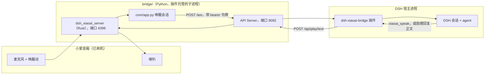

<div align="center">
  <h1>DSH XiaoAI Bridge</h1>
  <p>把小爱音箱接进 DeepSeek Harness：喊一声唤醒词，答案从音箱里念出来。</p>
  <p>桥接器是一个本地 Python 服务（源码在 <code>bridge/</code>），由插件当子进程托管；设置页、状态卡、播报纪律都在插件这一半。</p>

  <p>
    <a href="CHANGELOG.md"></a>
    <a href="https://github.com/deepseek-ai/dsh"></a>
    <a href="LICENSE"></a>
    <a href="https://github.com/OMSociety/dsh-xiaoai-bridge/stargazers"></a>
    <a href="https://github.com/OMSociety/dsh-xiaoai-bridge/issues"></a>
  </p>

<a href="#这是什么">这是什么</a> • <a href="#核心特性">核心特性</a> • <a href="#工作原理">工作原理</a> • <a href="#快速开始">快速开始</a> • <a href="#模型工具">模型工具</a> • <a href="#配置项">配置项</a> • <a href="#数据放在哪">数据放在哪</a> • <a href="#排错">排错</a> • <a href="#开发">开发</a> • <a href="#许可证与作者">许可证与作者</a>
</div>

> **免责声明：**本项目是非官方技术研究项目，与小米及其关联公司没有隶属、合作、授权或背书关系。刷机与客户端补丁有风险，动手前先读 [DISCLAIMER.md](DISCLAIMER.md)。

## 这是什么

**dsh-xiaoai-bridge** 把一台刷过 open-xiaoai 客户端补丁的小爱音箱，变成 DeepSeek Harness 的**语音入口**：喊唤醒词说话，语音在本地识别后提交给一个真正的 DSH 会话，回答再从音箱念出来。

它不只是个播报器——会话是完整的 DSH 会话（模型、工具、工作区都由你选），音箱只是它的耳朵和嘴。人在电脑上改代码，音箱在书房里答话，是同一场对话。

Python 桥接器的源码来自 [coderzc/open-xiaoai-bridge](https://github.com/coderzc/open-xiaoai-bridge)（MIT），上游又受 [Open-XiaoAI](https://github.com/idootop/open-xiaoai) 启发。本仓库是**独立演进**的项目，不跟进上游：DSH 对话后端（`core/dsh.py`、`core/dsh_conversation.py`）、播报纪律、鉴权与生命周期管理，以及 `dsh_xiaoai_server` 模块名与 `DSH_XIAOAI_TOKEN` 环境变量，都是在本仓库里加的。`bridge/` 的文档（`bridge/README.md`、`bridge/CHANGELOG.md`、`bridge/AGENTS.md`）里有一部分是从上游搬来的旧内容，示例与代码冲突时**以代码为准**；本仓库的改动逐条记在 [CHANGELOG.md](CHANGELOG.md) 里，署名与许可链条见 [LICENSE](LICENSE) 与 [DISCLAIMER.md](DISCLAIMER.md)。

## 核心特性

| 特性 | 说明 |
| --- | --- |
| **唤醒即对话** | 说出唤醒词即可说话，桥接器识别后提交给一个真正的 DSH 会话，答案再从音箱念出来 |
| **主动说话** | 桥接器没在跑就顺手拉起来（`autoStart` 关掉时不会：`ensureStarted()` 直接拒绝，返回 `bridge is not running (autostart is off)`）；`xiaoai_speak` 只注册在音箱发起的会话里，想让普通对话也能调，打开 `speakFromAnySession` |
| **半双工防自问自答** | 播放期间闸门关闭麦克风，插件不会听到自己刚念出去的话 |
| **播报留痕** | 每一句念出来的话都带来源写进 `spoken.jsonl`，跨重启保留 |
| **进程托管与看门狗** | 插件渲染 `config.py`、拉起解释器，按 2 / 5 / 15 / 30 秒递增退避重启，预算用尽后放弃并说明原因 |
| **接口鉴权** | loopback 信任，远端必须带 bearer 令牌；没配置令牌时远端直接 `401` |
| **状态卡** | 设置页显示连通状态、鉴权方式、令牌是否配置、看门狗（重启次数 / 是否已放弃 / 下次重试）与最近错误 |
| **卸载不留残渣** | 停进程树、探测 4399 与 9092、只删可重建文件，历史与陌生文件保留并上报 |
| **小爱模式（可选）** | 随仓库带一个 Agent 预设 `xiaoai`：会说话、能读写文件与查资料，没有终端、子代理与计划模式；装上之后音箱那个会话就按它组建，其他会话完全不受影响（没装则回落宿主默认，见 [preset/xiaoai/](preset/xiaoai/)） |

## 工作原理



端口分工：**4399** 是桥接器里 Rust 服务的固定端口，**9092** 是桥接器的 API Server（对应设置项 `apiServerPort`）。插件自己的路由挂在 DSH 宿主的 webServer 上，不额外占端口。

## 快速开始

**方式一：clone 到本地再装（推荐）**

Python 那一半需要一份可写的 checkout——虚拟环境与模型包都落在里面，所以推荐这一条：

```powershell
# 1) 先停掉正在运行的 DSH（运行中的服务会锁住依赖，装完再起）
git clone https://github.com/OMSociety/dsh-xiaoai-bridge D:\WorkSpace\dsh-xiaoai-bridge

# 2) 准备 Python 侧：Rust 扩展要现场编译，第一次通常十几分钟
Set-Location D:\WorkSpace\dsh-xiaoai-bridge\bridge
uv sync --no-install-project
uv sync

# 3) 装插件本体，然后重启 DSH
Set-Location D:\WorkSpace\dsh-xiaoai-bridge
dsh plugin --profile desktop add D:\WorkSpace\dsh-xiaoai-bridge
```

**方式二：从 GitHub 装**

只装插件那一半（`bridge/` 源码随包一起走，虚拟环境与模型包装好后自己补）：

```powershell
dsh plugin --profile desktop add "github:OMSociety/dsh-xiaoai-bridge#main"
```

> 装好后**重启 DSH**：宿主侧插件与客户端产物都在启动时加载，只刷新页面不够。桥接器不想放在插件目录里，就在设置页把 `bridgeDir` 指向你的 checkout。

**装完怎么用**

1. 下载模型包（只需一次，目标目录已被 `.gitignore` 忽略）：

   | 项 | 值 |
   | --- | --- |
   | 下载地址 | `https://github.com/coderzc/open-xiaoai-bridge/releases/download/vad-kws-asr-models/models.zip` |
   | 大小 / sha256 | 493,248,891 字节 / `8E8A709D6EA011F644F3C5055F536D5E6EB363EEAFBA53CC3232398FD636D273` |
   | 目标位置 | `bridge/core/models/`（压缩包顶层是 `models/`，搬进去即可） |

2. 打开设置页确认四项：**启用**、**音箱名称**、**音箱地址**（刷机后音箱的局域网地址）、**会话工作区**。
3. （可选）想要「小爱模式」：把仓库里的 [preset/xiaoai/](preset/xiaoai/) 装成一个 bundle（DSH 里用插件市场安装这个本地目录），装完设置页的 `agentPreset` 保持默认 `xiaoai` 就行。没装也不影响使用：只会回落成宿主默认预设，并留一条 `agent-preset-missing` 说明。
4. 说唤醒词（默认 `小爱小爱`）：音箱答一句 `小爱来了`，接下来的话被识别并提交给你选的会话。
5. 会话在**播报留痕**里留下每一句；想让它主动开口，在音箱那个会话里让它调 `xiaoai_speak`（工具默认只注册在那里；想让电脑或网页的普通对话也能调，打开设置里的 `speakFromAnySession`）。
6. 出问题时先看设置页的**运行状态**卡，再看本文的 [排错](#排错)。

> **提示：**音箱刷机与客户端补丁属于上游项目，见 [Open-XiaoAI 刷机教程](https://github.com/idootop/open-xiaoai/blob/main/docs/flash.md) 与 [Client 端补丁](https://github.com/idootop/open-xiaoai/blob/main/packages/client-rust/README.md)。

> **注意：**API Server 默认只监听 `127.0.0.1`。把 `apiServerHost` 改成 `0.0.0.0` 之前先确认令牌已配置，否则远端调用会被直接拒绝（fail closed）。

## 模型工具

| 工具 | 作用 | 关键参数 |
| --- | --- | --- |
| `xiaoai_speak` | 让小爱音箱念出指定文本；不必先有唤醒，桥接器没在跑时会按需拉起。只出现在**音箱发起的会话**的工具表里（打开 `speakFromAnySession` 则每个会话都看得见） | `text`（必填，要念的话；写成适合听的短句，别带 Markdown、代码块或 URL） |

模型的标准用法：**要念的话直接写进 `text`**。设置了「自动播报回复」时，模型这一轮没调工具就把回复正文念出来；调了工具就只念工具里那段——所以同一句话不会被念两遍。

随插件注册的技能 `xiaoai-speak` 写明了这套纪律（什么时候该主动开口、什么不该念、审批提示怎么处理），模型会在需要时自己读。

## 配置项

设置页里改；下面是常用项与默认值。页面按 7 个可折叠分区排：基本 / 唤醒与语音 / 应答与兜底 / 播报与回复器 / 人格与提示词 / 桥接器进程 / 本地 API 服务；`bridgeDir` 与 `pythonPath` 这类排障项收在「桥接器进程」下的**高级**折叠里。折叠与联动只改显示：某个开关关掉时它管着的那组项会隐藏，但已经填过的值和暂存的草稿都还在，开关打开就回来（见 [docs/deploy.md](https://github.com/OMSociety/dsh-xiaoai-bridge/blob/main/docs/deploy.md) §12.39）。版式不是自画的：分区头用宿主的折叠行原语，字段用宿主的设置字段组件，颜色与圆角全部取 `--dsw-*` 主题变量，所以深浅色跟随宿主、和插件市场里其它插件的设置页一致（见 §12.40）。

保存走 `POST /plugin/xiaoai/config`，写入前会用 `validateConfig()` 严格校验：不合法的值**当场回 400**（错误信息里带着是哪一项，例如 `wakeupTimeout must be a whole number of seconds in [1, 600]`），不会先存进去再说。校验在 revision 围栏之前跑，所以「既过期又不合法」的请求回的是 400 而不是 409。已经躺在设置里的坏值（手改过配置文件、或旧版本写进去的）走另一条路：载入时由 `sanitizeConfig()` 逐键回退成默认值，并只告警一次 `unusable config repaired with defaults: …`。

### 基本

| 配置项 | 类型 | 默认值 | 说明 |
| --- | --- | --- | --- |
| `enabled` | 布尔 | 开 | 总开关；关掉后只保留设置卡 |
| `deviceName` | 文本 | `小爱音箱` | 音箱显示名，出现在会话标题上 |
| `deviceHost` | 文本 | `192.168.1.191` | 刷机后音箱的局域网地址 |
| `sessionKey` | 文本 | `agent:main:dsh-xiaoai-bridge` | 形如 `agent:<agentId>:<rest>`；只喂给桥接器（日志前缀、按会话覆盖音色），DSH 侧不读它。本仓库默认值与上游文档不同（见 CHANGELOG） |
| `sessionCwd` | 工作区 | 空 | 音箱会话归入的工作区；空则用第一个工作区 |
| `agentPreset` | 文本 | `xiaoai` | 音箱那个会话按哪个 Agent 预设组建。本仓库带一个「小爱模式」（[preset/xiaoai/](preset/xiaoai/)，需要先在插件市场里安装它）；留空用宿主默认预设。填了但没安装**不是错误**：这次回落到宿主默认预设，并留下一条 `agent-preset-missing` 诊断（见 [docs/deploy.md](https://github.com/OMSociety/dsh-xiaoai-bridge/blob/main/docs/deploy.md) §12.36） |

### 唤醒与语音

| 配置项 | 类型 | 默认值 | 说明 |
| --- | --- | --- | --- |
| `wakeKeywords` | 文本 | `小爱小爱` | 唤醒词，一行一个 |
| `wakeupTimeout` | 数字 | `20` | 静默多少秒后结束对话；必须是 `1`–`600` 的整数，非整数或越界会被回退成默认值并在日志里告警一次 |
| `continuousConversation` | 布尔 | 关 | 开：一次唤醒可接着说；关：一句一次唤醒。只有打开时，「退出词」才出现 |
| `asrBackend` | 枚举 | `sense_voice` | 桥接器使用的语音识别后端 |
| `ttsProvider` | 枚举 | 跟随音色 | 跟随音色 / 小爱原生 / MiMo（预留，暂不生效）；选 MiMo 时下面四项才出现 |
| `ttsSpeaker` | 文本 | `xiaoai` | `xiaoai` 为小爱原生音色，填豆包音色 ID 则走豆包 TTS；`ttsProvider` 选 MiMo 时这一项隐藏 |
| `mimoBaseUrl`、`mimoApiKeyCredential`、`mimoModel`、`mimoVoice` | 文本 | 空 | MiMo 预留占位，只在 `ttsProvider` 选 MiMo 时出现；凭据只存名字，目前不发给桥接器 |

### 应答与兜底

| 配置项 | 类型 | 默认值 | 说明 |
| --- | --- | --- | --- |
| `wakeupReplyText` | 文本 | `小爱来了` | 唤醒词命中时念的一句 |
| `exitReplyText` | 文本 | `小爱，再见` | 对话结束时念的一句 |
| `exitKeywords` | 文本 | `退出`、`停止`、`再见` | 退出词，一行一个；只在 `continuousConversation` 打开时出现 |
| `fallbackText` | 文本 | `连不上电脑，请稍后再试` | 桥接器活着但插件连不上时念 |

### 播报与回复器

| 配置项 | 类型 | 默认值 | 说明 |
| --- | --- | --- | --- |
| `autoSpeak` | 布尔 | 开 | 模型没调工具时也把回复念出来；关掉后下面那组回复器项隐藏 |
| `speakFromAnySession` | 布尔 | 关 | 开：电脑或网页的普通对话也能调用 `xiaoai_speak`（工具注册回全局层）；关（默认）只有音箱发起的会话能调，工具也只出现在那个会话里（见 [docs/deploy.md](https://github.com/OMSociety/dsh-xiaoai-bridge/blob/main/docs/deploy.md) §12.34 与 §12.35） |
| `spokenMaxChars` | 数字 | `300` | 播报字数上限，超长先压缩一次再截断 |
| `approvalText` | 文本 | `需要你到电脑上确认一下` | 工具在屏幕上等待确认时念；审批正文永不出口 |
| `replyerProvider`、`replyerModel` | 文本 | 空 | 回复器路由；空则跟随会话模型。注意**切换模型只对回复器即时生效**：语音会话的 agent 路由在会话创建时就钉死了，要等 DSH 重启后才用上新模型（有意保留的取舍，见 [docs/deploy.md](https://github.com/OMSociety/dsh-xiaoai-bridge/blob/main/docs/deploy.md) §12.31.7） |
| `replyerHistoryTurns` | 数字 | `6` | 交给回复器的近期往返数 |
| `replyerFailureText` | 文本 | `回复器调用失败` | 回复器两次都失败时念 |

### 人格与提示词

| 配置项 | 类型 | 默认值 | 说明 |
| --- | --- | --- | --- |
| `personality` | 文本 | 内置 | 回复器的人格设定，默认就是回复器的身份句（「你是一个通过小爱音箱和用户说话的语音助手…」）；**改成别的**才会在系统提示里多出一行「关于你自己：…」 |
| `replyStyle` | 文本 | 内置 | 回复器的说话风格，默认「用日常、口语化的说法讲出来，就像对着用户说话一样。」 |
| `behaviorStyle` | 文本 | 内置 | 只注入音箱发起的会话，渲染成「行动准则：…」；默认是「不要包含 markdown、代码、emoji、颜文字、括号里的动作或心理描写、URL；一般 50 字以内、一两句话讲完，只有确实需要长回复时才展开，最多不超过 300 字。…」 |
| `outputLimits` | 文本 | 内置 | 回复器必须避开的东西（emoji、markdown、括号动作、URL 等），并声明长度口径：一般 50 字以内、长回复最多 300 字 |
| `voiceRuleText` | 文本 | 内置 | 追加到每条语音消息后，告诉 agent 回复会被念出来 |

### 桥接器进程

| 配置项 | 类型 | 默认值 | 说明 |
| --- | --- | --- | --- |
| `autoStart` | 布尔 | 开 | 跟随插件启动桥接器；关掉后需要桥接器的调用（如 `xiaoai_speak`）会直接失败并报 `bridge is not running (autostart is off)`，不会替你拉起进程 |
| `silentStart` | 布尔 | 关 | 开：连上音箱时不再播报「已连接」，启动不出声；只在 `autoStart` 打开时出现 |
| `logLevel` | 枚举 | `INFO` | 桥接器日志级别 |
| `bridgeDir` | 文本 | 空 | 「高级」折叠里的排障项：桥接器源码目录；空则用 `<插件>/bridge` |
| `pythonPath` | 文本 | 空 | 「高级」折叠里的排障项：跑桥接器的解释器；空则用 `<bridgeDir>/.venv/Scripts/python.exe` |

### 本地 API 服务

| 配置项 | 类型 | 默认值 | 说明 |
| --- | --- | --- | --- |
| `apiServerEnabled` | 布尔 | 开 | 是否提供桥接器 API；关掉后下面三项隐藏 |
| `apiServerHost` | 文本 | `127.0.0.1` | API Server 监听地址；保持 loopback 最安全 |
| `apiServerPort` | 数字 | `9092` | API Server 端口 |
| `apiServerTokenCredential` | 文本 | `XIAOAI_API_TOKEN` | 依凭据的**名字**，不是令牌本身 |

**安全边界（限制）：** 能触达 `POST /asr` 的调用方，等于拿到了这个 agent 的输入通道——识别出来的话会被当成真实用户意图送进 DSH 语音会话，插件在这一层**不做语义拦截**，也没有语音专用工具集。机械保障只有两条：bearer 门禁，以及宿主既有的审批流（工具卡在审批上时，音箱只念一句固定的提示语，审批请求正文从不念出来）。危险动作的约束基本只靠提示词和宿主审批；想收紧就在宿主侧配 approval policy（对本插件的 agent 生效）与「哪些工具允许免审批」，这不是本插件的开关。这是架构限制、不是缺陷；代码侧注释在 `lib/http.js` 的 `/asr` 路由，展开见 [docs/deploy.md](https://github.com/OMSociety/dsh-xiaoai-bridge/blob/main/docs/deploy.md) §12.31.8。

快速配置模板（对应设置页里常改的几项，等价于 `POST /plugin/xiaoai/config` 的 `patch`）：

```json
{
  "enabled": true,
  "deviceName": "书房音箱",
  "deviceHost": "192.168.1.191",
  "wakeKeywords": "小爱小爱",
  "continuousConversation": false,
  "autoSpeak": true,
  "sessionCwd": "D:\\WorkSpace",
  "approvalText": "需要你到电脑上确认一下",
  "spokenMaxChars": 300
}
```

## 数据放在哪

| 位置 | 内容 | 说明 |
| --- | --- | --- |
| `<DSH_HOME>/xiaoai-bridge/` | 桥接器的运行数据目录 | Windows 默认 `%USERPROFILE%\.dsh\xiaoai-bridge`；`DSH_HOME` 设了就跟着走 |
| `…/xiaoai-bridge/config.py` | 按设置渲染出的桥接器配置 | 每次启动与每次写入设置后重新渲染，删掉会自动重建 |
| `…/xiaoai-bridge/bridge.log` | 桥接器日志 | 也可用 `GET /plugin/xiaoai/bridge/logs` 取；跨重启保留 |
| `…/xiaoai-bridge/spoken.jsonl` | 播报留痕 | 每行一句念出去的话，带来源、模型与设备；跨重启保留；超过 5 MiB 时轮转到单槽 `spoken.jsonl.1`，所以历史只保留上一代 |
| `…/xiaoai-bridge/devices.json`、`device.json` | 见到的设备与上次用的设备 | 删掉只是重新认一遍；已被 `.gitignore` 挡住，不会入库 |
| `…/xiaoai-bridge/__pycache__/`、`bridge.pid`、`*.tmp` | 可重建的中间物 | 插件收尾时自动删除 |
| `<bridgeDir>/core/models/` | 模型包（VAD / KWS / ASR） | 约 470 MB，不随仓库走，按[快速开始](#快速开始)下载一次 |
| `<bridgeDir>/.venv/` | 桥接器的 Python 虚拟环境 | 由 `uv sync` 生成，插件默认就用这里的解释器 |

## 排错

先看**运行状态**卡：它把故障写成一句话，而不是留给你一台沉默的音箱。同样的编码也会写进 DSH 日志。

| 状态卡编码 | 通常意味着 |
| --- | --- |
| `bridge-unreachable` | API 端口没人应答：桥接器停了或还在启动 |
| `bridge-rejected` | 桥接器回了 401 / 403：插件发的令牌与桥接器启动时用的不是同一个 |
| `plugin-rejected` | 桥接器用错误的 bearer 令牌调了 `/asr`，通常是桥接器比令牌更早启动 |
| `bridge-error` | 桥接器回了别的 HTTP 错误，响应体在 detail 里 |
| `bridge-timeout` | 桥接器收下了请求，但没在超时前回答 |
| `start-failed` | 插件拉不起进程：检查 `pythonPath`、`bridgeDir`、模型包 |
| `watchdog-gave-up` | 桥接器反复退出，看门狗不再重试；原因就是最近错误 |
| `port-held` | 桥接器停止后端口仍在应答 |
| `token-not-applied` | 桥接器先于 API 令牌启动，只在 loopback 上应答；重启桥接器即可套用令牌（`warn`，不是错误） |
| `scope-registration-unavailable` | 这台 DSH 不支持按会话注册工具，`xiaoai_speak` 没有注册（见 [docs/deploy.md](https://github.com/OMSociety/dsh-xiaoai-bridge/blob/main/docs/deploy.md) §12.35；`warn`） |
| `scope-registration-failed` | 往音箱会话的作用域里注册 `xiaoai_speak` 时出错，detail 是宿主给的原文（`warn`） |
| `agent-preset-missing` | 设置里的 `agentPreset` 没安装，这次用宿主默认预设（detail 里有宿主给的原文；`warn`，见 §12.36） |
| `agent-preset-broken` | 设置里的 `agentPreset` 装了但激活失败（声明本身有问题），这次用宿主默认预设（`warn`） |
| `agent-preset-mount-failed` | 把预设挂到音箱会话上抛了异常，这次用宿主默认预设（detail 是原文；`warn`） |
| `session-archived-rebound` | 音箱绑定过的那个会话被归档了（归档的会话跑不了模型步，宿主会静默拒掉），插件改用新会话；detail 里有旧会话 id（`warn`，见 §12.43） |
| `asr-model-unavailable` | 设置页选的语音识别后端用不了（名字不认识，或模型没装、加载失败），桥接器仍在用原来那个；detail 里是桥接器给的原因（`warn`，见 §12.44） |

日志与状态分四处，别混着看：数据目录里的 `bridge.log`（真正的日志）、插件自己的 `GET /plugin/xiaoai/bridge/logs`（读同一份日志，可带 `limit`）、桥接器 API `http://127.0.0.1:9092/api/health`（状态端点，回 `{status, speaker_ready, auth, asr}`）、插件自己的 `GET /plugin/xiaoai/health`（状态端点，回 facts）。播报留痕 `spoken.jsonl` 不是日志而是历史：它有 5 MiB 上限，超了就整体轮转到单槽 `spoken.jsonl.1`，**旧的一代会被下一次轮转覆盖**，所以长期留痕只能靠自己另存。更细的内容——pnpm 供应链坑、模型目录、鉴权中间件、每一期的决策——都在 [docs/deploy.md](https://github.com/OMSociety/dsh-xiaoai-bridge/blob/main/docs/deploy.md)（这份文件不随包发布，所以用绝对地址）。

卸载：

```powershell
dsh plugin --profile desktop remove dsh-xiaoai-bridge
# 若 profile 的 package.json 里 dsh.profile.bundles 仍列着它，一并删掉，再重启 DSH
```

想连历史一起清空，再调一次显式路由（请求体必须写明确认）：

```powershell
Invoke-RestMethod -Method Post -Uri http://127.0.0.1:19387/plugin/xiaoai/data/wipe `
  -ContentType 'application/json' -Body '{"confirm":"wipe"}'
```

## 开发

```powershell
node scripts\check-client.mjs      # 客户端 bundle：控件、标签、字段接线
node scripts\check-config.mjs      # 配置渲染：覆盖层、稀疏渲染、真机加载
node scripts\check-keywords.mjs    # 唤醒词 / 退出词解析
node scripts\check-session.mjs     # 会话与设备路由、工作区分组
node scripts\check-supervisor.mjs  # 进程托管：接管、替换、看门狗退避与放弃
node scripts\check-speak.mjs       # 播报：工具、回复器、审批、按需拉起
node scripts\check-diagnostics.mjs # 错误库与失败分类
node scripts\check-http.mjs        # HTTP 层：鉴权、体积上限、同源、路由
node scripts\check-cleanup.mjs     # 数据目录切分与端口探测

Set-Location bridge
.\.venv\Scripts\python.exe -m pytest -q   # 桥接器侧（含 DSH 单次对话、鉴权、TTS 路由）
```

目录与「改东西去哪」：

```
lib/index.js        插件入口：设置卡片、生命周期、session/event 转发
lib/process.js      桥接器子进程：启动、停止、日志、看门狗、渲染配置
lib/tools.js        xiaoai_speak 工具（含「没到桥接器就按需拉起」）
lib/exposure.js     工具与技能注册到哪一层：音箱会话的作用域，或（开逃生门时）全局
preset/xiaoai/      随仓库发布的「小爱模式」Agent 预设（插件市场里点一次安装）
lib/auto-speak.js   播报纪律：什么时候出声、谁来措辞、念过什么
lib/bridge.js       桥接器 HTTP 客户端与失败分类
lib/diagnostics.js  错误库（稳定 code + 原始 detail）
lib/client.js       设置页与运行状态卡（客户端 bundle）
skills/xiaoai-speak/  教模型什么时候开口的技能
bridge/             Python 桥接器（DSH 后端在 core/dsh*.py）
scripts/            九个自检脚本 + check-all.mjs 聚合入口（`npm run check`），改动前后都该跑
docs/deploy.md      实施与验证记录：每一期的决策、坑与取证（不随包发布）
TODO.md             发布前待办：MiMo TTS 接线、版本收口、实机验收（不随包发布）
```

## 更新日志

版本与逐条变更见 [CHANGELOG.md](CHANGELOG.md)；插件自 `0.1.0` 起记录，桥接器部分沿用上游的 [bridge/CHANGELOG.md](bridge/CHANGELOG.md)。

## 支持与致谢

- 如果这个插件对你有帮助，欢迎点亮 Star；有问题或建议请提交 [Issue](https://github.com/OMSociety/dsh-xiaoai-bridge/issues) 或 [Pull Request](https://github.com/OMSociety/dsh-xiaoai-bridge/pulls)。
- 想改行为：插件侧看 `lib/`，桥接器侧看 `bridge/core/`；唤醒词、超时、播报口径都能在设置页里改，不必动代码。

- [coderzc/open-xiaoai-bridge](https://github.com/coderzc/open-xiaoai-bridge)（MIT）：Python 桥接器、Rust 服务、模型包与它的上游历史都来自这里
- [Open-XiaoAI](https://github.com/idootop/open-xiaoai)（MIT）：音箱刷机与客户端补丁的整套思路
- [DeepSeek Harness](https://github.com/deepseek-ai/dsh)：插件、设置卡片、技能与宿主的 webServer

## 许可证与作者

[MIT](LICENSE)。上游版权行 `Del Wang`、`coderzc` 原样保留，本仓库新增部分的版权行追加在其后：© 2026 [@OMSociety](https://github.com/OMSociety)。使用与再分发条款以 `LICENSE` 为准，风险提示见 [DISCLAIMER.md](DISCLAIMER.md)。
