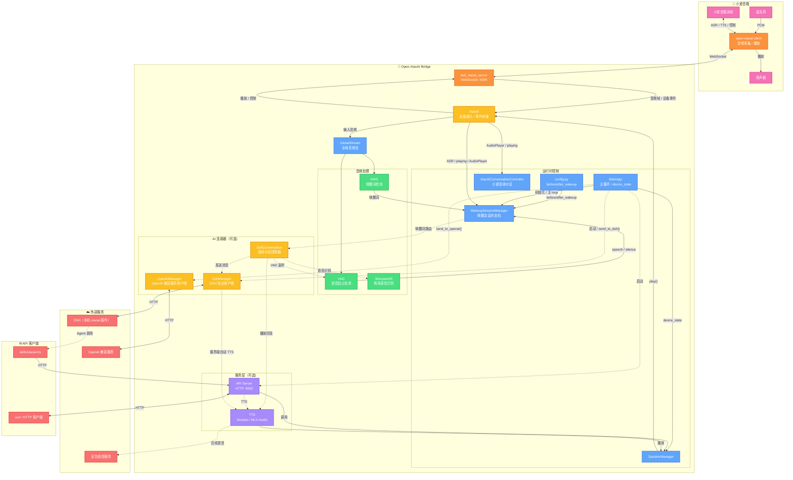

<div align="center">

# Bridge（bridge/）

[](https://www.python.org/) [](https://www.rust-lang.org/) [](../LICENSE) [](https://github.com/coderzc/open-xiaoai-bridge/stargazers) [](https://ghcr.io/coderzc/open-xiaoai-bridge)

[](https://github.com/coderzc/open-xiaoai-bridge/releases)

**小爱音箱与外部 AI 服务（DSH、OpenAI 兼容服务）的桥接器**

打破小爱音箱的封闭生态，灵活接入多种 AI 服务，提供 HTTP API 实现远程控制。

[📺 演示 ①](https://www.bilibili.com/video/BV1DHcBz1Ex7) · [📺 演示 ②](https://www.bilibili.com/video/BV1UQQSBHEvg)

[📖 快速开始](#-快速开始) · [🔊 TTS 配置](#-tts-配置) · [🔌 OpenAI 兼容服务](#-openai-兼容服务) · [DSH 集成](#dsh-集成) · [🔧 API 文档](#-api-server) · [🐛 常见问题](#-常见问题)

> 本项目受 [Open-XiaoAI](https://github.com/idootop/open-xiaoai) 启发，并参考其 `examples/` 示例演进而来，现已作为独立项目持续维护。

> **关于本文件**：这个文件有一部分是从上游 `coderzc/open-xiaoai-bridge` 搬来的旧内容，
> 只改写过品牌字样、删掉了不适用的章节，正文结构仍是上游的。因此文中个别徽章、
> 演示视频与 Docker 镜像链接仍指向上游仓库与上游镜像（它们不是本仓库的产物）；
> 本仓库的入口文档是根目录的 [README.md](../README.md)，示例与代码冲突时以代码为准，
> 改动逐条记在 [CHANGELOG.md](../CHANGELOG.md) 与 [bridge/CHANGELOG.md](CHANGELOG.md) 里。

</div>

***

## ✨ 功能一览

| 功能                 | 说明                                                                             |
| ------------------ | ------------------------------------------------------------------------------ |
| 🔌 **OpenAI 兼容服务** | 接入 Hermes Agent API Server、OpenAI、Ollama、LM Studio 等 `/v1/chat/completions` 服务 |
| **DSH 集成**        | 接入本机 DeepSeek Harness 的 xiaoai 桥接插件，支持连续对话与按会话选择 TTS 音色                   |
| 🎙️ **自定义唤醒词**     | 支持中英文，不同唤醒词可路由到不同 AI 服务                                      |
| 🧠 **多 Agent 路由**  | 一台音箱，多个唤醒词，可通过 `set_dsh_session_key()` 动态切换会话                       |
| 💬 **连续对话**        | 多轮对话无需反复唤醒，喊"小爱同学"可随时打断                                                        |
| ⚡ **VAD + KWS**    | 语音活动检测前置，减少无效识别，更省电                                                            |
| 🌐 **HTTP API**    | 远程播放文字/音频、控制音箱                                                                 |
| 🧩 **模块化**         | 各功能独立开关，按需启用                                                                   |
***

## 🚀 快速开始

> **⚠️ 本项目仅包含服务端**，需要先在小爱音箱上安装 Client 端。

### 📦 前置步骤

1. **🔧 刷机** — 更新小爱音箱固件，开启 SSH
   - [刷机教程](https://github.com/idootop/open-xiaoai/blob/main/docs/flash.md)
2. **🛠️ 音箱补丁程序安装 Client** — 在音箱上运行 Rust Client 端
   - [补丁程序安装教程](https://github.com/coderzc/open-xiaoai/blob/main/packages/client-rust/README.md)

### 📥 模型文件

如果 DSH / OpenAI 兼容服务连续对话使用 `local_asr`，需要下载 `VAD + KWS + ASR` 模型文件。

如果 DSH / OpenAI 兼容服务连续对话使用 `xiaoai_asr`，只需要 `VAD + KWS`，不需要本地 ASR 模型。

1. 从 [releases](https://github.com/coderzc/open-xiaoai-bridge/releases/tag/vad-kws-asr-models) 下载模型压缩包
2. 解压模型文件（路径见下方具体部署方式）

### 🐳 Docker Compose（推荐）

> **注意（本 fork）**：本节的 compose 与镜像都来自**上游**，拉到的桥接器**不含本 fork 的
> bearer 鉴权门禁与 DSH 后端接线**。仓库里的 `bridge/docker-compose.yml` 已在文件顶部
> 写明这一点。要让本插件的"默认带鉴权"承诺成立，请改用下面的[本地编译](#-本地编译)运行；
> 只有在明确要跑上游桥接器时才用 Docker 路线。

模型文件解压到 `./models` 目录，然后下载配置并启动：

```bash
# 下载配置文件
curl -O https://raw.githubusercontent.com/coderzc/open-xiaoai-bridge/main/config.py
curl -O https://raw.githubusercontent.com/coderzc/open-xiaoai-bridge/main/docker-compose.yml

# 按需修改 config.py 和 docker-compose.yml，然后启动
docker compose up -d
```

> **💡 国内镜像加速**：如果拉取镜像太慢，可将 `docker-compose.yml` 中的镜像改为：
> ```yaml
> image: ghcr.nju.edu.cn/coderzc/open-xiaoai-bridge:latest
> ```

> **💡 容器访问宿主机服务**：如果需要让容器访问宿主机上的 DSH 插件，请查看 [Docker 常见问题](#-docker)。

`docker-compose.yml` 已包含模型目录挂载：

```yaml
volumes:
  - ./models:/app/core/models
```

### 💻 本地编译

模型文件解压到 `core/models/` 目录，然后克隆仓库并启动：

```bash
git clone https://github.com/coderzc/open-xiaoai-bridge.git
cd open-xiaoai-bridge

# 依赖: uv, Rust
# Linux 还需要: pkg-config, patchelf

# 启动（按需设置环境变量）
API_SERVER_ENABLE=1 DSH_ENABLE=1 OPENAI_ENABLE=1 ./scripts/start.sh

# 启用 Client 鉴权（需与音箱端 token 一致）
DSH_XIAOAI_TOKEN=your-secret-token API_SERVER_ENABLE=1 ./scripts/start.sh
```

### ⚙️ 环境变量

| 变量                   | 说明            | 默认值           |
| -------------------- | ------------- | ------------- |
| `DSH_ENABLE`         | 启用 DSH 后端    | 禁用            |
| `OPENAI_ENABLE` | 启用 OpenAI 兼容服务 | 禁用        |
| `API_SERVER_ENABLE`  | 启用 HTTP API | 禁用            |
| `AUDIO_INPUT_ENABLE` | 启用音频输入（关闭后 KWS / local\_asr 不可用） | 启用            |
| `API_SERVER_HOST`    | API 监听地址    | `127.0.0.1`   |
| `API_SERVER_PORT`    | API 监听端口    | `9092`        |
| `DSH_XIAOAI_TOKEN`  | Client 鉴权 token，设置后仅持有相同 token 的 Client 才能连接 | 不鉴权 |
| `XIAOAI_API_TOKEN`   | DSH 后端的 API Token（优先级高于 `dsh.token`） | 空             |
| `CONFIG_PATH`        | 自定义配置文件路径   | `./config.py` |
| `LOGLEVEL`           | 日志级别        | `INFO`        |

***

## 🏗️ 系统架构



### 工作流程

**DSH 唤醒与对话**

```
麦克风 → client → server → XiaoAI → GlobalStream → KWS/小爱 ASR
→ WakeupSessionManager → before_wakeup() → VAD speech/silence
→ DshConversationController → SherpaASR 离线识别 → DshManager
→ 本机 DeepSeek Harness xiaoai 插件 → TTS 播放
```

**🔄 小爱连续对话**

```
小爱 ASR / AudioPlayer 事件 → XiaoAIConversationController
→ 决定继续唤醒或退出
```

**🌐 远程控制**

```
curl POST /api/play/text → API Server → SpeakerManager → 小爱音箱
```

***

## 🔌 API Server

设置 `API_SERVER_ENABLE=1` 启用，默认端口 **9092**。

### 📡 端点列表

| 方法     | 路径                       | 说明           |
| ------ | ------------------------ | ------------ |
| `POST` | `/api/play/text`         | 播放文字（TTS）    |
| `POST` | `/api/play/url`          | 播放音频链接       |
| `POST` | `/api/play/file`         | 上传并播放音频文件    |
| `POST` | `/api/tts/doubao`        | 豆包 TTS 合成并播放 |
| `GET`  | `/api/tts/doubao_voices` | 获取可用音色列表     |
| `POST` | `/api/wakeup`            | 唤醒小爱音箱       |
| `POST` | `/api/interrupt`         | 打断当前播放       |
| `GET`  | `/api/status`            | 获取播放状态       |
| `GET`  | `/api/health`            | 健康检查         |

### 💡 使用示例

```bash
# 播放文字
curl -X POST http://localhost:9092/api/play/text \
  -H "Content-Type: application/json" \
  -d '{"text": "你好，我是小爱同学"}'

# 播放音频链接
curl -X POST http://localhost:9092/api/play/url \
  -H "Content-Type: application/json" \
  -d '{"url": "https://example.com/audio.mp3"}'

# 上传音频文件
curl -X POST http://localhost:9092/api/play/file \
  -F "file=@/path/to/audio.mp3"

# 豆包 TTS（可指定音色）
curl -X POST http://localhost:9092/api/tts/doubao \
  -H "Content-Type: application/json" \
  -d '{"text": "你好", "speaker_id": "zh_female_cancan_mars_bigtts"}'

# 打断播放
curl -X POST http://localhost:9092/api/interrupt
```

***

## 🔊 TTS 配置

Bridge 的 TTS provider 配置跟随各个后端，配置层级保持不变：

- `openai.tts_provider` 和 `dsh.tts_provider` 都可以选择小爱原生、豆包、官方 OpenAI / 兼容服务或本地 MLX-Audio。
- 各后端继续使用自己的 `tts_speaker` 或 `session_tts_speakers`；不填写 `tts_provider` 时，保持旧逻辑：`xiaoai` 使用小爱原生，其他音色 ID 使用豆包。

### 选择 TTS provider

在对应后端配置中增加 `tts_provider` 即可，原有的 `tts_speaker` 不需要删除：

```python
"openai": {
    "tts_provider": "mlx_audio",  # xiaoai / doubao / openai / mlx_audio
    "tts_speaker": "xiaoai",
}
```

同样的字段也可以放在 `dsh` 中：

```python
"dsh": {
    "tts_provider": "doubao",
    "tts_speaker": "zh_male_raphael_bigtts",
},
```

| `tts_provider` | 运行位置 | 额外配置 |
|---|---|---|
| `xiaoai` | 音箱本地原生 TTS | 无，音色由小爱设备决定 |
| `doubao` | 火山引擎云端 TTS | `tts.doubao`，需要 `app_id` 和 `access_key` |
| `openai` | 官方 OpenAI 或其他兼容服务 | `tts.openai` |
| `mlx_audio` | Mac 本地 MLX-Audio 服务 | `tts.mlx_audio` |

### 小爱原生 TTS

不需要启动额外服务，直接使用音箱自带的合成能力：

```python
"openai": {
    "tts_provider": "xiaoai",
    "tts_speaker": "xiaoai",
}
```

### 豆包 TTS

先在 [火山引擎语音合成控制台](https://www.volcengine.com/docs/6561/1871062) 开通服务，然后配置鉴权信息和默认音色：

```python
"tts": {
    "doubao": {
        "app_id": "你的 App ID",
        "access_key": "你的 Access Key",
        "default_speaker": "zh_female_vv_uranus_bigtts",
        "audio_format": "pcm",
        "stream": True,
    },
},
"openai": {
    "tts_provider": "doubao",
    # 填豆包音色 ID 可覆盖 default_speaker；填 xiaoai 则使用 default_speaker
    "tts_speaker": "xiaoai",
}
```

音色 ID 见 [火山引擎音色库](https://www.volcengine.com/docs/6561/1257544?lang=zh)。豆包的流式配置和声音复刻说明见下方 [豆包 TTS 常见问题](#-豆包-tts-常见问题)。

### OpenAI / 兼容服务 TTS

适用于官方 OpenAI，以及实现 `POST /v1/audio/speech` 的其他服务。在需要使用它的后端中配置 `tts_provider = "openai"`，然后填写共享的 `tts.openai`：

```python
"tts": {
    "openai": {
        "base_url": "https://api.openai.com/v1",
        "api_key": "your-api-key",
        "model": "gpt-4o-mini-tts",
        "voice": "alloy",
        "instructions": "自然、放松地说话，不要播音腔。",
        "response_format": "wav",
        "speed": 1.0,
        "timeout": 120,
        "stream_format": "audio",
        "extra_body": {},
    },
},
"openai": {
    "tts_provider": "openai",
    "tts_speaker": "xiaoai",  # 改成具体 voice ID 可覆盖 tts.openai.voice
}
```

适配器发送标准非流式字段：`model`、`input`、`voice`、`instructions`、`response_format` 和 `speed`。当前音箱播放链路支持 `mp3`、`flac`、`wav`、`ogg`、`pcm`；协议层虽然接受 `opus` 和 `aac`，但这两种格式不适合作为 Bridge 的音箱播放格式。当前不支持流式 TTS，设置 `stream_format = "sse"` 或在 `extra_body` 中启用 `stream` 会明确报错。

### MLX-Audio TTS

适用于 Apple Silicon 本地部署的 [MLX-Audio](https://github.com/Blaizzy/mlx-audio) 服务。在需要使用它的后端中配置 `tts_provider = "mlx_audio"`；Bridge 在 Docker 中运行时，通过 `host.docker.internal` 访问 Mac 宿主机：

```python
"tts": {
    "mlx_audio": {
        "base_url": "http://host.docker.internal:8000/v1",
        "api_key": "",
        "model": "mlx-community/Qwen3-TTS-12Hz-1.7B-VoiceDesign-6bit",
        "mode": "voice_design",  # 或 "custom_voice"
        "voice": None,             # VoiceDesign 不需要预设音色
        "lang_code": "Chinese",
        "response_format": "wav",
        "speed": 1.0,
        "instruct": "年轻男性，自然聊天，标准普通话，无明显地域口音。",
        "timeout": 120,
        "extra_body": {},
    },
},
"openai": {
    "tts_provider": "mlx_audio",
    "tts_speaker": "xiaoai",
}
```

`voice_design` 用 `instruct` 描述音色，`custom_voice` 使用模型提供的 `voice`。适配器复用 OpenAI TTS 的 HTTP、鉴权、超时和错误处理，同时把标准 `instructions` 映射为 MLX-Audio 的 `instruct`，并额外支持 `lang_code` 等本地模型参数。协议层支持 `wav`、`mp3`、`flac`、`ogg` 和 `opus`；交给音箱播放时建议使用 `wav`、`mp3`、`flac` 或 `ogg`，不支持 `stream=true`。

### 音频格式与流式限制

- 本地音箱播放优先使用 `wav`；云端服务可根据延迟和带宽选择 `mp3` 或 `pcm`。
- OpenAI / MLX-Audio 适配器当前采用“完整音频文件 → 音箱播放”，不把 SSE 音频流当作完整文件处理。
- 豆包 TTS 保留独立的 `stream` 配置，可使用 PCM 或 MP3 流式播放。

***

## 🔌 OpenAI 兼容服务

用于接入 Hermes Agent API Server、OpenAI、Ollama、LM Studio 等兼容 OpenAI Chat Completions 的服务。它是独立后端，不依赖其他连接器。

设置 `OPENAI_ENABLE=1` 启用。

`config.py` 示例：

```python
"openai": {
    "base_url": "http://127.0.0.1:8000/v1",
    "api_key": "",
    "model": "gpt-4o-mini",
    "input_mode": "local_asr",  # 或 "xiaoai_asr"
    "session_key": "default",
    "system_prompt": "",
    "temperature": 0.7,
    "max_tokens": 512,
    "history_max_messages": 20,
    "tts_provider": "mlx_audio",  # 详见「🔊 TTS 配置」
    "tts_speaker": "xiaoai",
}
```

TTS provider 的选择和音频参数见上方 [🔊 TTS 配置](#-tts-配置)。

触发连续对话时，在 `before_wakeup` 中返回 `"openai"`：

```python
async def before_wakeup(speaker, text, source, app):
    if source == "kws" and "小黑" in text:
        await speaker.play(text="小黑来了")
        return "openai"

    if source == "xiaoai" and text == "召唤小黑":
        await speaker.abort_xiaoai()
        return "openai"
```

单次发送并播报：

```python
if "让小黑" in text:
    await speaker.abort_xiaoai()
    await app.send_to_openai_and_play_reply(text.replace("让小黑", ""))
    return None
```

`base_url` 可以直接填到 `/v1`，框架会自动调用 `/chat/completions`；如果你的服务已经给出完整 `/v1/chat/completions` 地址，也可以直接填写完整地址。连续对话会按 `session_key` 保存最近 `history_max_messages` 条上下文；需要隔离多个助手时，可在唤醒前调用 `app.set_openai_session_key("assistant-name")`。

## DSH 集成

用于接入本机的 DeepSeek Harness xiaoai 桥接插件：桥接器把识别到的文本通过 HTTP 发送给 DSH 的 `xiaoai` 插件端点，由 DSH 侧决定回复内容，并可通过 API Server 主动播放语音。

设置 `DSH_ENABLE=1` 启用。端点默认是本机回环地址 `http://127.0.0.1:19387/plugin/xiaoai`，由 DSH 桌面端托管。

`config.py` 示例：

```python
"dsh": {
    "base_url": "http://127.0.0.1:19387/plugin/xiaoai",
    "token": "",                      # 运行时优先使用环境变量 XIAOAI_API_TOKEN
    "session_key": "agent:main:open-xiaoai-bridge",
    "device_name": "",
    "response_timeout": 120,
    "input_mode": "local_asr",        # 或 "xiaoai_asr"
    "exit_keywords": ["退出", "停止", "再见"],
    "wakeup_keywords": ["小爱小爱"],   # 命中即路由到 DSH 连续对话
    "tts_provider": None,             # xiaoai / doubao / openai / mlx_audio
    "tts_speaker": "xiaoai",
    "session_tts_speakers": {},
    "tts_speed": 1.0,
},
```

### 交互方式

默认唤醒词为「小爱小爱」（`wakeup.keywords` 与 `dsh.wakeup_keywords` 都要包含），触发后进入 DSH 连续对话：

- `local_asr`：本地 VAD 检测语音 → SherpaASR 离线识别 → 发送给 DSH → TTS 播放
- `xiaoai_asr`：静默唤醒小爱 → 接管小爱原生 ASR 结果 → 发送给 DSH → TTS 播放
- 说「退出」/「停止」/「再见」或静音超时退出

来自小爱的指令（`source == "xiaoai"`）按整句匹配 `dsh.wakeup_keywords`，同样可以进入 DSH 连续对话。

### 自定义唤醒词

在 `config.py` 的 `wakeup.keywords` 里增加唤醒词（KWS 检测用），并在 `dsh.wakeup_keywords` 里同步增加（路由用）：

```python
"wakeup": {
    "keywords": ["你好小黑", "小黑你好", "小爱小爱", "你好小爱"],
},
"dsh": {
    "wakeup_keywords": ["小爱小爱", "你好小爱"],
},
```

### 多 Agent 路由

在 `before_wakeup()` 里于 `return "dsh"` 之前调用 `app.set_dsh_session_key(...)` 即可动态切换会话：

```python
AGENT_SESSIONS = {
    "小美": "agent:xiaomei:open-xiaoai-bridge",
    "管家": "agent:butler:open-xiaoai-bridge",
}

async def before_wakeup(speaker, text, source, app):
    if source == "kws":
        for keyword, session_key in AGENT_SESSIONS.items():
            if keyword in text:
                app.set_dsh_session_key(session_key)
                return "dsh"
    return None
```

`session_key` 统一为 `agent:<agentId>:<rest>` 格式，框架在每次唤醒前会自动重置为 `dsh.session_key` 的默认值。

### rule_prompt

`rule_prompt` / `rule_prompt_for_skill` 会分别拼接在 `send()` / `send_and_play_reply()` 的消息末尾，用于约束回复格式：

```python
"dsh": {
    "rule_prompt": "注意：将结果处理成纯文字版，不要返回任何 markdown 格式，并将字数控制在300字以内",
    "rule_prompt_for_skill": "注意：这条消息是主人通过小爱音箱发送的，他看不到你回复的文字。字数控制在300字以内",
},
```

### DSH TTS 音色

DSH 后端的 TTS provider 与音色配置见 [🔊 TTS 配置](#-tts-配置)；按会话覆盖音色用 `session_tts_speakers`：

```python
"dsh": {
    "tts_provider": "doubao",
    "tts_speaker": "xiaoai",
    "session_tts_speakers": {
        "agent:xiaomei:open-xiaoai-bridge": "zh_female_vv_uranus_bigtts",
    },
},
```

### Skills

DSH 侧可以调用桥接器的 [xiaoai-tts skill](./skills/xiaoai-tts) 通过 HTTP API 主动播放语音；也可以用 `app.send_to_dsh_and_play_reply(text)` 发送消息并直接播放回复。

***

## ❓ 常见问题

### 🐳 Docker

> **注意（本 fork）**：下面的问答都假定你跑的是**上游镜像**
> `ghcr.io/coderzc/open-xiaoai-bridge:latest`。该镜像不含本 fork 的 bearer 鉴权门禁，
> 照它部署出来的桥接器与本插件的鉴权承诺不一致；正式部署请走[本地编译](#-本地编译)。

1. **在容器里如何通过 `127.0.0.1` 直连宿主机上的 DSH 插件？**

    桥接模式下，容器里的 `127.0.0.1` / `localhost` 指向的是**容器自己**，不是宿主机。

    如果你希望通过 `127.0.0.1` 直连宿主机上的 DSH 插件，有两种方式：

    **方式 1：增加 `network_mode: host`**

    在 `docker-compose.yml` 里添加：

    ```yaml
    services:
        open-xiaoai-bridge:
            network_mode: host
    ```

    **方式 2：通过网络 IP 连接（无需 host 模式）**

    如果不使用 `network_mode: host`，可以让 DSH 插件监听 LAN，然后在容器里通过宿主机的局域网 IP 连接：

    ```python
    # config.py
    "dsh": {
        "base_url": "http://192.168.5.123:19387/plugin/xiaoai",
        "token": "xxxxx",
    },
    ```

    PS: 最好固定宿主机的 IP 地址。

### 🎙️ 唤醒词与连续对话

1. **模型文件在哪下载？**

    DSH / OpenAI 兼容服务的 `local_asr` 模式需要 `VAD + KWS + ASR` 模型文件。  
    `xiaoai_asr` 模式只需要 `VAD + KWS`。

    详见[快速开始 - Docker Compose](#-docker-compose推荐) 或 [本地编译](#-本地编译) 章节。

2. **如何切换 ASR 语音识别模型？**

    仅 `dsh.input_mode = "local_asr"`（或对应后端的 `input_mode`）时，ASR 配置才会生效。在 `config.py` 中配置：

    ```python
    APP_CONFIG = {
        "asr": {
            "model": "sense_voice",  # "sense_voice"（默认）/ "paraformer" / "fire_red_asr" / "doubao"
            "int8": True,            # 本地模型优先加载 INT8 量化模型
            # "model_dir": "sherpa-onnx-fire-red-asr-xxx",  # 可选：显式指定本地模型目录
        },
    }
    ```

    | 模型 | 说明 | 特点 |
    |------|------|------|
    | `sense_voice` | [SenseVoice-Small](https://github.com/FunAudioLLM/SenseVoice) | 多任务语音理解模型，支持中/英/日/韩/粤五语种自动识别，附带语言检测、ITN 和情感识别，推理极快 |
    | `paraformer` | [Paraformer-Trilingual](https://github.com/modelscope/FunASR) | 专注语音转写的工业级非自回归模型，支持中文/英文/粤语，中文识别精度高 |
    | `fire_red_asr` | [FireRedASR](https://github.com/FireRedTeam/FireRedASR) | FireRedASR 是一系列开源的工业级自动语音识别 (ASR) 模型，支持普通话、汉语方言和英语，在公开的普通话 ASR 基准测试中达到了新的最先进水平 (SOTA)，同时还提供了出色的歌词识别能力。 |
    | `doubao` | [火山引擎豆包语音识别](https://www.volcengine.com/docs/6561/1354868?lang=zh) | 云端录音文件识别，支持标准版和极速版，需要配置火山引擎 App Key / Access Key |

    使用本地模型时，将对应模型目录放到 `core/models/`（Docker 部署放 `./models/`）下即可，不配置默认使用 `sense_voice`。

    使用豆包 ASR 时，将 `model` 改为 `"doubao"`，并填写 `asr.doubao`：

    ```python
    APP_CONFIG = {
        "asr": {
            "model": "doubao",
            "doubao": {
                # "standard": 录音文件识别标准版，调用 /submit + /query
                # "flash": 录音文件极速版，调用 /recognize/flash
                "mode": "standard",
                "app_key": "你的 App Key",
                "access_key": "你的 Access Key",
                # 火山 X-Api-Resource-Id：
                # standard 可选：
                #   "volc.bigasr.auc"  - 豆包录音文件识别模型 1.0
                #   "volc.seedasr.auc" - 豆包录音文件识别模型 2.0
                # flash 可选：
                #   "volc.bigasr.auc_turbo" - 录音文件极速版
                "resource_id": "volc.seedasr.auc",
                "language": "",
                "submit_timeout": 10,
                "query_timeout": 10,
                "poll_interval": 0.5,
                "max_wait_seconds": 20,
            },
        },
    }
    ```

    `standard` 模式会把本地 PCM 封装为 wav 后以 base64 提交到标准版接口；如果你的火山账号不支持该请求形式，可切换为 `flash` 并将 `resource_id` 改为 `"volc.bigasr.auc_turbo"`。

3. **如何打断 AI 的回答？**

    直接喊"小爱同学"即可打断 DSH 或 OpenAI 兼容服务的回答。

4. **话没说完 AI 就开始回答？**

    调大 `min_silence_duration`：

    ```python
    APP_CONFIG = {
        "vad": {
            "min_silence_duration": 1000,  # 毫秒
        },
    }
    ```

5. **唤醒词没反应？**

    - 调低 `vad.threshold`（越小越灵敏，如 `0.05`）
    - 启动后需等约 30s 加载模型
    - 英文唤醒词用空格分开（如 `"open ai"`）
    - 换更易识别的唤醒词

6. **麦克风音量太小，唤醒词 / ASR 识别不准？**

    在 `config.py` 中调大输入增益：

    ```python
    APP_CONFIG = {
        "audio_input": {
            "gain": 2.0  # 增益倍数，1.0 = 不处理；建议从 2.0 开始逐步调整
        },
    }
    ```

    > 增益过高会引入失真，反而影响识别，适度调整即可。

7. **如何播放服务端本地音频文件？**

    可以直接调用：

    ```python
    await speaker.play(server_file="/path/to/hello.wav")
    ```

    这里的路径是**运行 open-xiaoai-bridge 的这台机器**上的本地文件路径，不是音箱里的路径。
    如果是 Docker 部署，请记得把对应目录挂载进容器。

### 🎵 豆包 TTS 常见问题

1. **如何配置豆包 TTS？**

    配置示例、provider 选择和音色说明见上方 [🔊 TTS 配置](#-tts-配置) 的「豆包 TTS」小节。

2. **如何使用声音复刻？**

   1. 在[火山引擎控制台](https://console.volcengine.com/speech/service/10036?AppID=)「声音复刻详情」中获取预分配的 Speaker ID（格式 `S_xxxxxxxx`）
   2. 准备一段 10-30 秒清晰人声音频（支持 wav/mp3/m4a 等，≤10MB）
   3. 运行克隆脚本：
   ```bash
   python3 scripts/clone_voice.py --speaker-id S_xxxxxxxx --audio sample.wav
   ```
   训练完成后会输出 demo 试听链接和可用的模型类型（ICL 1.0 / ICL 2.0）。
   4. **重要**：确保复刻音色与 `tts.doubao.app_id` 属于**同一个火山引擎项目**，否则无法使用。
3. **如何将指定文本转成特定音色的音频文件？**

   可以使用脚本 [scripts/generate_tts.py](scripts/generate_tts.py)：
   ```bash
   python3 scripts/generate_tts.py \
     --speaker-id zh_male_lengkugege_emo_v2_mars_bigtts \
     --text "你好，今天心情很好" \
     --emotion happy \
     --output ./output/happy.wav
   ```
   其中 `--speaker-id` 必填，`--text` 和 `--text-file` 二选一，`--output` 用来指定输出文件名；`--emotion` 仅部分多情感音色支持。

4. **支持流式播放吗？怎么配置？**

   支持。推荐配置：
   ```python
   "tts": {
       "doubao": {
           "stream": True,           # 流式播放，首音延迟更低
           "audio_format": "pcm",    # 局域网推荐，首音更快
           # "audio_format": "auto", # 短文本 PCM，长文本 MP3
       }
   }
   ```
   - `pcm`：首音快，流式稳定，长文本总耗时可能更高
   - `mp3`：传输效率高，长文本更早结束
   - `auto`：折中方案，按文本长度自动选择

   冒烟测试（无需音箱，验证 TTS 是否正常）：
   ```bash
   python3 tests/test_tts_stream.py                                           # 测试流式 TTS 连通性
   python3 tests/test_tts_latency.py --formats mp3,pcm --rounds 3 --repeat 8  # 对比 mp3/pcm 延迟
   ```

## 致谢

感谢 [Open-XiaoAI](https://github.com/idootop/open-xiaoai) 及其 `examples/` 示例提供的启发与参考。

***

## 🚨 免责声明

本项目为非官方技术研究项目，与小米及其关联公司不存在任何隶属、合作、授权、认可或背书关系。

使用者应自行确认其使用行为符合适用法律法规、平台规则、设备厂商政策及相关服务协议，并自行承担由下载、安装、配置、修改、传播或使用本项目所产生的全部风险与责任。

详细免责声明请见 [DISCLAIMER.md](../DISCLAIMER.md)。项目授权与分发条件以仓库中的 [LICENSE](../LICENSE) 文件为准。

***

## 📚 参考资源

| 资源              | 链接                                                                                                                                                                                                                                                       |
| --------------- | -------------------------------------------------------------------------------------------------------------------------------------------------------------------------------------------------------------------------------------------------------- |
| 🔧 刷机教程         | [刷机教程](https://github.com/idootop/open-xiaoai/blob/main/docs/flash.md)                                                                                                                                                                                   |
| 🛠️ Client 端安装  | [Client 端安装](https://github.com/idootop/open-xiaoai/blob/main/packages/client-rust/README.md)                                                                                                                                                            |
| 🎙️ 豆包 TTS 音色列表 | [火山引擎文档](https://www.volcengine.com/docs/6561/1257544)                                                                                                                                                                                                   |

***

<div align="center">

**Made with ❤️ by** **[coderzc](https://github.com/coderzc)**

如果这个项目对你有帮助，请给它一颗 ⭐️

</div>
